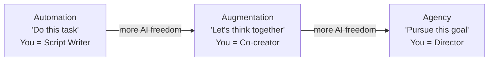
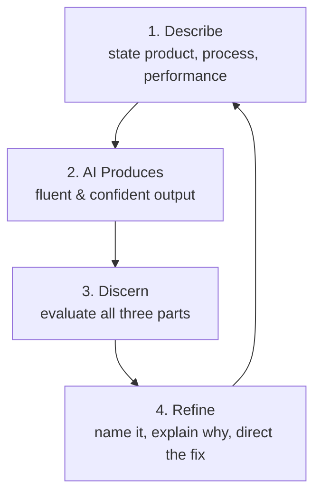
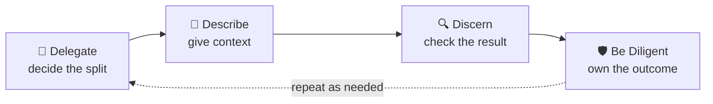

# 📘 Chapter 1 — AI Fluency: The 4Ds

> [!NOTE]
> **Source:** [agentfactory.panaversity.org/docs/ai-fluency-crash-course](https://agentfactory.panaversity.org/docs/ai-fluency-crash-course)
> **Reading time:** ~30 minutes · **Track:** Claude Certified Associate — Foundations

---

## 📑 Table of Contents

- [Part 1: Bara Tasawwur (The Big Picture)](#part-1-bara-tasawwur-the-big-picture)
  - [1. AI Access alag hai, AI Fluency alag hai](#1-ai-access-alag-hai-ai-fluency-alag-hai)
  - [2. AI ke sath kaam karne ke 3 tareeqay](#2-ai-ke-sath-kaam-karne-ke-3-tareeqay)
- [Part 2: Chaar Competencies (4Ds)](#part-2-chaar-competencies-4ds)
  - [3. Delegation](#3-delegation--kaam-kis-ne-karna-hai)
  - [4. Description](#4-description--ai-ko-woh-dena-jo-usay-chahiye)
  - [5. Discernment](#5-discernment--confidence-ko-correctness-na-samajhna)
  - [6. Diligence](#6-diligence--ai-ko-zimmedari-se-use-karna)
- [Part 3: 4Ds ko Milakar Kaam Karna](#part-3-4ds-ko-milakar-kaam-karna)
  - [7. 4D Operating Loop](#7-4d-operating-loop)
  - [8. Chaar Aam Beginner Mistakes](#8-chaar-aam-beginner-mistakes)
- [One-Line Recap](#-one-line-recap)

---

## Part 1: Bara Tasawwur (The Big Picture)

### 1. AI Access alag hai, AI Fluency alag hai

Sirf powerful AI tak access hona iska matlab nahi ke aap ussay achi tarah use karna jantay hain. Do log same model, same plan pe kaam karein — ek acha kaam nikal aata hai, dusra sirf polish si cheez banata hai jo throw ho jati hai. Fark tool ka nahi, **use karne ke tareeqay** ka hota hai.

<!-- ^ Placeholder for figure: "Four Qualities of AI Fluency" — replace src with your copied GitHub attachment link -->

> [!TIP]
> **4 Qualities of AI Fluency:** Effective (goal tak pohanchna) · Efficient (time/tokens waste na karna) · Ethical (honest tareeqe se use karna) · Safe (privacy/security protect karna)

**4Ds:** Delegation → Description → Discernment → Diligence
**Yaadasht:** Decide → Explain → Check → Own

<!-- ^ Placeholder for figure: "LLM Reality — Plausible vs Correct" -->

> [!WARNING]
> **3 baatein jo yaad rakhni hain (pichlay chapter se):**
> 1. **Plausible correct nahi hota** — AI confident answer de sakta hai jo ghalat ho (hallucination).
> 2. **Output badalta rehta hai** — same sawal, alag waqt pe alag jawab.
> 3. **AI sirf available information se kaam karta hai** — agar zaroori info missing hai, AI guess kar sakta hai.

---

### 2. AI ke sath kaam karne ke 3 tareeqay

Fark yeh hai ke AI ko kitni **azadi** di gayi hai next step decide karne ki.

| Mode | Aap dete hain | AI decide karta hai | Aap ka role |
|---|---|---|---|
| **Automation** | Specific task/steps | Bohat kam | Script writer |
| **Augmentation** | Sath mil kar sochna | Thinking partner ki tarah | Co-creator |
| **Agency** | Goal + boundaries | Kaafi saare next steps | Director |

<!-- ^ Placeholder for figure: "Three Modes Spectrum" -->

> [!IMPORTANT]
> Agency ke do lafz sabse important hain:
> - **"Future"** — aap room mein nahi ho gay, AI baad mein kaam karega.
> - **"For others"** — jo insaan AI se baat karega woh aap khud nahi hongay, koi customer ya student hoga.
>
> Isi liye judgment pehle se AI mein build karni parti hai, kyun ke har decision supervise nahi ho sakta.

Koi bhi mode "behtar" nahi hai — fluency yeh hai ke sahi mode chuna jaye jo task ki zaroorat ho, aur teeno modes ek hi project mein use ho saktay hain.

---

## Part 2: Chaar Competencies (4Ds)

### 3. Delegation — Kaam kis ne karna hai

Sabse aam beginner mistake **pehle prompt se pehle** hoti hai — log yeh decide kiye baghair type karna shuru kar detay hain ke goal kya hai, achha result kaisa dikhega, aur kaunsa hissa AI ko dena hai.

<!-- ^ Placeholder for figure: "Delegation — Three Parts" -->

**Delegation ke 3 parts:**

1. **Problem awareness** — goal aur kaam samajhna, success kya hai.
2. **Platform awareness** — kaunsa AI tool/system is kaam ke liye theek hai.
3. **Task delegation** — kaam ko jaan-boojh kar divide karna (kaun sa hissa insaan karega, kaun sa AI).

> [!TIP]
> Sawal sirf "Kya AI yeh kar sakta hai?" nahi — sawal yeh hai: **"Kaunsa hissa AI karay, kaunsa main karoon, aur kyun?"**
>
> Example: invoice-chasing agent banane se pehle business policy questions clear karne parhtay hain — kaunse customers, kitne din late, kis amount pe human approval chahiye.

> [!WARNING]
> AI aapki business policy khud decide nahi kar sakta jab tak aap jaan-boojh kar woh authority na dein — aur kai cases mein aisa karna bhi nahi chahiye.

---

### 4. Description — AI ko woh dena jo usay chahiye

AI mind-reading nahi kar sakta. Agar koi zaroori cheez chhoot gayi, woh reasonable guess karega — jo ghalat bhi ho sakta hai.

<!-- ^ Placeholder for figure: "Description — Three Parts" -->

**Description ke 3 parts:**

1. **Product description** — "Mujhe kya wapas chahiye?" (output type, audience, format, length, tone).
2. **Process description** — "AI kaam kaise approach karay?" (steps, order, method, examples).
3. **Performance description** — "AI kaisa behave karay?" (concise/detailed, supportive/challenging, assumptions le ya sawal poochay).

> [!IMPORTANT]
> **Completeness usually matters more than clever wording** — vague request se clear, complete request behtar hota hai.
>
> Performance description chat mein sirf aap ke liye hoti hai; system scale pe yeh un logon ke liye hoti hai jo AI ko kabhi nahi milengay (jaise ek tutoring agent ka rule ke woh seedha answer na de).

> [!NOTE]
> **Prompt engineering** poochta hai "Message kaise likhoon?"
> **Context engineering** poochta hai "AI ko success ke liye kya kya information chahiye?" (documents, memory, tools, policies, examples, waghera)

---

### 5. Discernment — Confidence ko correctness na samajhna

AI aksar confident sound karta hai — yeh readability ke liye acha hai, trust ke liye khatarnak.

> [!WARNING]
> **Automation Bias:** Insaan ki yeh aadat ke automated answer ko zyada asani se trust kar lena, khaas kar jab woh professional lagay. Fluent likhawat, citation jaisi link, confident tone — koi bhi **proof nahi** hai.

**Discernment ke 3 parts:**

1. **Product discernment** — kya result factually sahi hai, complete hai, expert-credible hai?
2. **Process discernment** — kya is tareeqe se kaam karna actually faida day raha hai (ya AI ka draft edit karne mein utna hi time lag raha hai jitna khud likhne mein)?
3. **Performance discernment** — jab AI khud (agency mein) kaam kar raha ho, kya woh dusray logon ko achi tarah serve kar raha hai? (Sirf aggregate mein dikhta hai, isliye yeh eval/monitoring infrastructure ban jata hai.)

<!-- ^ Placeholder for figure: "The Description–Discernment Loop" -->

> [!TIP]
> **Feedback ka pattern:** Problem → Why it matters → Direction (sirf "Wrong, try again" kehna kaafi nahi).
>
> Kabhi kabhi discernment yeh dikhata hai ke asal masla Delegation mein tha — galat tool chuna gaya, ya galat kaam AI ko diya gaya.

> [!NOTE]
> **Hallucination** = confident/plausible AI output jo fabricated ya galat ho.

---

### 6. Diligence — AI ko zimmedari se use karna

Pehle teen Ds behtar result dilatay hain. Diligence poochta hai: **"Kya mujhe AI is tarah use karna bhi chahiye?"**

<!-- ^ Placeholder for figure: "Diligence — Three Moments" -->

**Diligence ke 3 parts:**

1. **Creation diligence** — kaam shuru karne se pehle: kya data confidential hai? Kya yeh tool organization se approved hai?
2. **Transparency diligence** — jab AI ka role dusron ko affect karay (academic work, hiring, customer communication), to uske role ke baray mein honest rehna.
3. **Deployment diligence** — publish/send/execute karne se pehle verify karna: facts, sources, calculations, bias, permissions.

> [!IMPORTANT]
> Powerful final sawal: **"Would I confidently put my name on this?"** Agar jawab na hai, to kaam ready nahi hai.
>
> **AI kaam automate kar sakta hai, accountability nahi.** Agar AI-assisted system galat decision leta hai, organization phir bhi responsible hoti hai.

---

## Part 3: 4Ds ko Milakar Kaam Karna

### 7. 4D Operating Loop

**Delegate → Describe → Discern → Be diligent → Repeat as needed.**

**Example — Ayesha, Forward Deployed Engineer (Lahore):** ek accounting practice ke liye bookkeeping Digital FTE banati hai (monthly bank reconciliation):

- **Delegation:** Agent match kar sakta hai, unmatched flag kar sakta hai — lekin har journal adjustment, write-off, aur tax-related decision insaan ke paas rehta hai.
- **Description:** Chart of accounts, matching rules, past examples, escalation rules diye jatay hain — plus yeh rule ke agent kabhi khud journal entry post nahi karega.
- **Discernment:** Purani reconciliations pe test hota hai — kitne matches sahi hain, kitne galat slip ho jatay hain, kya escalation sahi ho raha hai.
- **Diligence:** Client data approved infrastructure mein rehta hai, actions log hotay hain, clients ko disclosure milti hai, aur ek human partner final sign-off karta hai.

<!-- ^ Placeholder for figure: "From Chat Skill to Factory System" -->

| Competency | In a chat | In the Agent Factory |
|---|---|---|
| **Delegation** | Decide what to ask AI to do | Scope the Digital FTE and human/AI boundary |
| **Description** | Give instructions and context | System prompts, skills, context engineering, Systems of Record |
| **Discernment** | Review the answer | Evals, monitoring, sampling, trusting the checker |
| **Diligence** | Protect data and own the result | Governance, permissions, audit, disclosure, human review |

> [!TIP]
> **"Agent Factory AI fluency ko replace nahi karta — usay industrialize karta hai."**

---

### 8. Chaar Aam Beginner Mistakes

| # | Mistake | Missing Skill |
|---|---|---|
| 1 | Problem define kiye baghair prompt karna | Delegation |
| 2 | Pehla answer hi final maan lena | Description + Discernment loop |
| 3 | Polished answer ko professional lag ne ki wajah se trust kar lena | Discernment |
| 4 | Privacy/accountability sirf tab sochna jab kuch ghalat ho jaye | Diligence |

---

## 🎯 One-Line Recap

> [!IMPORTANT]
> AI fluency ka matlab hai: **Delegation** se decide karo AI kya karay, **Description** se usay poori tarah bata do, **Discernment** se check karo jo mila woh acha hai ya nahi, aur **Diligence** se poori zimmedari khud lo — kyun ke AI kaam automate karta hai, accountability nahi.

**Delegation → Description → Discernment → Diligence**

