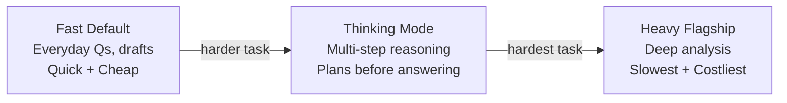
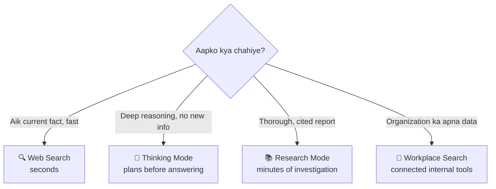
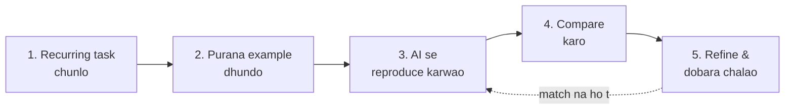

# 📘 Chapter 2 — Claude and ChatGPT 101: A Crash Course

> [!NOTE]
> **Source:** [agentfactory.panaversity.org/docs/claude-chatgpt-101-crash-course](https://agentfactory.panaversity.org/docs/claude-chatgpt-101-crash-course)
> 
> · **Track:** Claude Certified Associate — Foundations

---

## 📑 Table of Contents

- [Part 1: The Cockpit](#part-1-the-cockpit)
  - [1. Do Cockpits, Aik Discipline](#1-do-cockpits-aik-discipline)
  - [2. Models aur Thinking Modes](#2-models-aur-thinking-modes)
  - [3. Context Jo Aap Attach Karte Hain](#3-context-jo-aap-attach-karte-hain)
- [Part 2: Workspace ko Apna Banana](#part-2-workspace-ko-apna-banana)
  - [4. Projects](#4-projects--aik-room-aik-kaam-ke-liye)
  - [5. Memory aur Standing Instructions](#5-memory-aur-standing-instructions)
  - [6. Artifacts aur Writing Blocks](#6-artifacts-aur-writing-blocks)
  - [7. Skills aur Plugins](#7-skills-aur-plugins--packaged-tareeqay)
- [Part 3: Reach Ko Extend Karna](#part-3-reach-ko-extend-karna)
  - [8. Connectors, Apps, aur Question Routing](#8-connectors-apps-aur-question-routing)
  - [9. Purane Kaam Pe Prove Karna](#9-purane-kaam-pe-prove-karna)
- [One-Line Recap](#-one-line-recap)

---

## Part 1: The Cockpit

### 1. Do Cockpits, Aik Discipline

Claude aur ChatGPT dono khol kar dekhein — dono kaafi milte julte hain: purani chats ki list, message box, model control, files/tools menu, projects, memory, search aur research features.

Yeh similarity important hai — **aapko do alag tareeqay seekhne ki zaroorat nahi**. Sirf aik discipline seekhni hai, phir dekhna hai ke har product ne apne controls kahan rakhe hain.

> [!TIP]
> **Jo skills transfer hoti hain:** task clearly describe karna · useful context dena · kya delegate karna hai decide karna · answer check karna · kab strong model use karni hai · sensitive info protect karna

> [!NOTE]
> Pilot jahaz badalne pe poori flying dobara nahi seekhte — sirf switches ki jagah dekhtay hain. Yahan bhi aisay hi hai: "flying" (discipline) transferable hai, "switch layout" (interface) har baar look-up karna parta hai.

**Platform awareness** yahan bhi lagu hoti hai: important kaam ke liye same task dono assistants mein chalao aur compare karo — kisi aik tool se "loyal" mat bano.

**Sabse important beginner habit:** serious request bhejne se pehle 3 cheezein cover karo:
1. **Stage set karo** — aap kaun hain, goal kya hai
2. **Task define karo** — bilkul kya karna hai
3. **Rules set karo** — tone, format, constraints, examples

> [!IMPORTANT]
> Interface achi description ka replacement nahi hai — yeh sirf usay rehne ki jagah deta hai. **Pattern seekho, button ki jagah nahi.**

---

### 2. Models aur Thinking Modes

Model names hamesha badaltay rehtay hain — inhein yaad karna galat approach hai. Iski jaga **3-level pattern** seekho.

<!-- ^ Placeholder for figure: "The Model Tier Pattern" -->

| Level | Best For | Trade-off |
|---|---|---|
| Fast default | Everyday questions, drafts, summaries | Fast/cheap, kam depth |
| Thinking/Reasoning | Multi-step reasoning, math, mushkil code | Slower, ziyada careful |
| Heavy flagship | Sabse mushkil analysis, lambe tasks | Sabse slow/costly, sabse capable |

> [!TIP]
> **2 Simple Rules:**
> - **Rule 1:** Start fast — normal kaam ke liye fast mode use karo.
> - **Rule 2:** Escalate karo jab task mushkil ho (multi-step logic, careful comparison, math, debugging, complex analysis).

> [!WARNING]
> Kabhi kabhi "AI fail ho gaya" ka matlab hota hai "maine ghalat capability level use ki thi."

**Yaad rakhne wala rule:** Fast for everyday → Thinking for hard reasoning → Flagship for genuinely difficult. Naam badal jayein, pattern kaam karta rahega.

---

### 3. Context Jo Aap Attach Karte Hain

Model sirf usi information se kaam karta hai jo uske samne ho — isi liye attachments important hain (PDFs, Word docs, spreadsheets, CSV, images, screenshots, code files).

Compare karo:
> "Summarize this contract." (bina attachment)
> "Summarize this contract." *(contract attached ke sath)*

Lafz almost same hain — dusra useful hai kyun ke AI contract *dekh* sakta hai.

> [!TIP]
> Screenshot dikhana usually memory se describe karne se behtar hota hai — dashboard, error message, chart, waghera.

**Habit banao:** important sawal poochne se pehle socho — **"Ek capable human colleague ko yeh achi tarah answer karne ke liye kya dekhna parta?"** Phir wahi material AI ko do.

---

## Part 2: Workspace ko Apna Banana

### 4. Projects — Aik Room, Aik Kaam ke Liye

Kuch hafton baad sidebar messy ho jata hai — ek client pe multiple chats, background dobara explain karna, waghera. **Projects** isi ka hal hain.

<!-- ^ Placeholder for figure: "Project Anatomy" -->

Aik project mein 3 cheezein hoti hain:
1. **Chats** — us kaam se related
2. **Knowledge** — upload ki gayi files
3. **Instructions** — us project ke andar standing guidance

> [!NOTE]
> Project ka poora point: **context persistent ho jata hai ek stream of work ke liye** — files dobara upload nahi karni parhtin, instructions dobara nahi likhni parhtin.

**Claude vs ChatGPT mein farak:**
- **Claude:** growth ko **retrieval** se handle karta hai — knowledge context window se bara ho to Claude search karna shuru kar deta hai (up to 10x capacity), paid-plan feature.
- **ChatGPT:** **project memory** deta hai — default memory (wider memory bhi shamil) ya project-only memory (sirf isi project tak mehdood).

> [!TIP]
> **Test:** Agar aap ne same background 3 baar explain kiya hai ya same file 3 baar upload ki hai — us kaam ko project deserve karta hai. One-off sawal ke liye project nahi chahiye.

---

### 5. Memory aur Standing Instructions

<!-- ^ Placeholder for figure: "The Persistence Triad" -->

Teen features context persist karte hain — beginners inhein mix kar detay hain:

| Feature | Kis Liye | Example |
|---|---|---|
| **Standing Instructions** | Stable rules | "Answer pehle do, phir explanation" |
| **Memory** | Evolving context | Preferences, recurring goals |
| **Projects** | Scoped work | Aik client/topic ka poora context |

> [!IMPORTANT]
> **Rule of thumb:** Instructions for stable rules. Memory for evolving context. Projects for scoped work. Yeh aik rule most configuration mistakes rok deta hai.

> [!WARNING]
> **Memory zimmedari bhi hai** — sensitive/private info store ho sakti hai. Jo remembered hai usay review karo, jo nahi rehna chahiye usay delete karo. **Incognito/temporary chat "memory-free" hain, "trace-free" nahi** — vendors ~30 din tak safety review ke liye copy rakhte hain.

---

### 6. Artifacts aur Writing Blocks

Chat conversation ke liye acha hai, lekin finished work ke liye kharab container hai. Agar aapko 2000-word report, calculator, diagram, ya small app chahiye, result ek separate object hona chahiye.

- **Claude — Artifacts:** separate output jo conversation ke sath khulta hai (document, code, webpage, diagram, calculator, dashboard, small app).
- **ChatGPT — Writing/Code Blocks:** editable regions jo thread ke andar inline baithtay hain (canvas ab retire ho chuka hai 2026 mein).

> [!TIP]
> **Behtar result ke liye:** "aik dashboard banao" mat kaho — batao finished cheez kya karay. Jaise: "Monthly budget tracker banao — categories se expenses enter kar sakoon, pie chart dikhay, aur budget se ooper jane pe warning day."

**Yaad rakho:** Chat = conversation; Artifacts/Writing Blocks/Code Blocks = actual kaam.

---

### 7. Skills aur Plugins — Packaged Tareeqay

Projects sawal ka jawab detay hain "sahi knowledge sath kaise rakhoon?" Repetition dusra sawal khara karti hai: **"AI se same method har baar kaise follow karwaoon?"** — yeh **skills** ka kaam hai.

**Skill** = packaged tareeqa (instructions + examples + resources + kabhi kabhi code), jo matching task pe load hoti hai.

> [!NOTE]
> Dono vendors **Agent Skills open standard** (agentskills.io) pe based hain — skill sirf Markdown files ka folder hai, no server, no runtime — isi liye ek product ke liye likhi skill dusre mein bhi install ho sakti hai.

**Plugin** = skills + connectors + kabhi commands/sub-agents ko mila kar aik installable package (aik poori job function ke liye).

**ChatGPT ka Custom GPT:** apni instructions, persona, knowledge, tools ke sath separately configured assistant — yeh skill se alag cheez hai.

Comparison ek line mein:
- **Project:** ek stream of work ka context store karta hai
- **Skill:** ek task ka method store karta hai
- **Custom GPT:** apna separately configured assistant deta hai
- **Plugin:** capabilities ko package kar deta hai

> [!IMPORTANT]
> **Line yaad rakho:** Projects store knowledge. Skills perform tasks.

---

## Part 3: Reach Ko Extend Karna

### 8. Connectors, Apps, aur Question Routing

Real information aksar kahin aur hoti hai — email, calendar, cloud storage, project tools. **Connectors** (Claude) ya **Apps** (ChatGPT) — same category, alag naam — AI ko un systems tak pohanchatay hain.

> [!NOTE]
> **MCP (Model Context Protocol)** dono ecosystems ka shared standard hai — "USB-C for AI tools" jaisa. Lekin: **USB-C plug karna trust decision nahi, MCP tool connect karna hai.** Plug standard hai, access nahi.

> [!WARNING]
> Connect karne se pehle poochein:
> 1. Yeh kya read kar sakta hai?
> 2. Kya yeh write/send/delete/buy kar sakta hai?
> 3. Kya mujhe source pe trust hai?
> 4. Kya mujhe yeh account/system connect karne ki ijazat hai?

<!-- ^ Placeholder for figure: "Route the Question Before You Send It" -->

| Aapko Chahiye | Use Karo |
|---|---|
| Aik current fact | Web Search |
| Hard reasoning, no new info | Thinking Mode |
| Thorough, cited investigation | Research Mode |
| Organization ka data | Workplace Search / Connected Apps |

> [!TIP]
> Research mode "behtar search" nahi hai — AI khud investigation plan karta hai, kai searches chalata hai, sources parhta hai, aur structured cited report deta hai. Yeh minutes leta hai, seconds nahi. **Judgment yahan bhi zaroori hai — important claims check karo, citations kholo.**

---

### 9. Purane Kaam Pe Prove Karna

Sabse important sawal: **"Mujhe kaise pata chalega ke AI mere kaam mein actually acha hai?"** — benchmark pe nahi, demo pe nahi — **aapke apne task, apne data, apne standard pe.**

<!-- ^ Placeholder for figure: "Prove It on Work You Already Know" -->

**5-Step Proving Loop:**
1. Aik recurring task chuno — precise raho
2. Aik purana example dhundo jiska correct result pata ho
3. AI se usay reproduce karwao
4. Compare karo — kya match hua, kya miss hua
5. Refine karo aur dobara chalao, jab tak acha na ho ya pata chal jaye ke yeh task delegate nahi karna chahiye

> [!IMPORTANT]
> **Passing test kya prove karta hai?** Similar future work ke liye **earned confidence** deta hai. Yeh accountability transfer NAHI karta — aap phir bhi naye results check karogay, unke peeche khare hongay, aur zaroorat parhne pe AI ka role disclose karogay.

---

## 🎯 One-Line Recap

> [!IMPORTANT]
> Claude aur ChatGPT do alag tools hain, aik hi discipline pe bane — models/thinking se capability control karo, attachments se context do, **Projects se scoped work**, **Instructions se stable rules**, **Memory se evolving context**, **Artifacts/Writing Blocks se finished kaam**, **Skills/Plugins se repeatable methods**, **Connectors/Apps + MCP se external reach**, aur **purane trusted kaam pe test karke** confidence kamao — accountability kabhi transfer nahi hoti.

**Instructions (stable) → Memory (evolving) → Projects (scoped)**

---

# Claude and ChatGPT 101: A Crash Course

**GIAIC · The AI Agent Factory · Exam Preparation · Claude Certified Associate — Foundations · 2026**

**Built By Ismail Ahmed Shah | GIAIC 2026**

Made with ❤️ for the AI Builders Community

