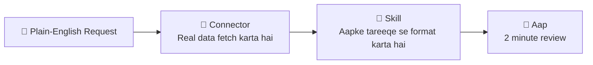

# 📘 Chapter 3 — Skills & Connectors: Teach AI Once, Connect It to Your Apps

> [!NOTE]
> **Source:** [agentfactory.panaversity.org/docs/skills-connectors-crash-course](https://agentfactory.panaversity.org/docs/skills-connectors-crash-course)
> **Reading time:** ~30–35 minutes · **Track:** Claude Certified Associate — Foundations

---

## 📑 Table of Contents

- [The One Idea Under Everything](#the-one-idea-under-everything)
- [Part 1: The Two Upgrades](#part-1-the-two-upgrades)
  - [1. Chat Box se Operating Layer Tak](#1-chat-box-se-operating-layer-tak)
  - [2. Skill Actually Kya Hai](#2-skill-actually-kya-hai)
  - [3. Connector Actually Kya Hai](#3-connector-actually-kya-hai)
  - [4. Skills vs Connectors vs Projects vs Custom Instructions](#4-skills-vs-connectors-vs-projects-vs-custom-instructions)
  - [5. Slash Command ya AI Khud Jaanta Hai?](#5-slash-command-ya-ai-khud-jaanta-hai)
- [Part 2: Jo Pehle Se Maujood Hai Usay Use Karna](#part-2-jo-pehle-se-maujood-hai-usay-use-karna)
  - [6. Built-in Skills](#6-built-in-skills)
  - [7. Apps Connect Karna](#7-apps-connect-karna)
  - [8. Asal Jaadu — Skills + Connectors Sath](#8-asal-jaadu--skills--connectors-sath)
  - [9. Kis Problem ko Kya Chahiye?](#9-kis-problem-ko-kya-chahiye)
- [Part 3: Apni Skill Banana](#part-3-apni-skill-banana)
  - [10. Sabse Fast Rasta — AI se Likhwao](#10-sabse-fast-rasta--ai-se-likhwao)
  - [11. SKILL.md ki Anatomy](#11-skillmd-ki-anatomy)
  - [12. Description Field — Poora Khel](#12-description-field--poora-khel)
  - [13. Test Karo, Phir Iterate Karo](#13-test-karo-phir-iterate-karo)
  - [14. Skill Save aur Share Karna](#14-skill-save-aur-share-karna)
- [Part 4: Aik Skill, Paanch Jagah](#part-4-aik-skill-paanch-jagah)
- [Part 5: Safely Use Karna](#part-5-safely-use-karna)
- [One-Line Recap](#-one-line-recap)

---

## The One Idea Under Everything

> **Aik chat message AI ko batata hai kya karna hai "sirf iss baar." Aik Skill AI ko sikhati hai kaise karna hai "har baar." Aik Connector AI ko "haath" deta hai taake woh aapke real apps tak pohanch sakay.**

<!-- ^ Placeholder for figure: "The Kitchen Analogy" -->

**Professional kitchen analogy:**
- **One-time chat message** = counter pe order shout karna ("sandwich banao") — banta hai, bhula diya jata hai.
- **Connectors** = kitchen khud (stove, knives, pantry, fridge) — inke baghair cook describe kar sakta hai, bana nahi sakta.
- **Skills** = recipe cards — step-by-step instructions, aapke restaurant ke tareeqe se, chahe koi bhi cook kar raha ho.

> [!TIP]
> **6 lafz yaad rakho:** Skill · Connector · Fire/Trigger (jab AI khud activate karay) · Scope (kitni access di) · Read-only vs Write access · Progressive disclosure (AI sirf short summary rakhta hai, poori instructions sirf zaroorat pe kholta hai)

---

## Part 1: The Two Upgrades

### 1. Chat Box se Operating Layer Tak

Har roz ki friction: accountant har mahine same formatting rules paste karta hai, doctor SOAP format dobara explain karta hai, marketer brand voice dobara paste karta hai. **Repeatable task, apne specific tareeqe se** — yehi shape Skill ke liye perfect hai.

Dusri friction: data kahin aur hota hai — Excel file, Google Drive, project tracker. AI reason kar sakta hai, **agar information usay milay**. Copy-paste ki keemat hai jo **Connector** hata deta hai.

> [!IMPORTANT]
> Dono mila kar chat box ab "chat box" nahi rehta — yeh aik capable colleague ban jata hai jo aapke standards jaanta hai (Skills) aur aapke files/tools tak pohanch sakta hai (Connectors). Isay **operating layer** kaha jata hai.

---

### 2. Skill Actually Kya Hai

Ek Skill sirf **ek folder hai jisme text file ho.** Required file ka naam exactly `SKILL.md` hota hai — top pe **name** aur **description**, neeche instructions.

> [!TIP]
> Minimum skill = name + description + ek paragraph plain-English instructions. Baaki (examples, templates, scripts) optional hai — aur scripts bhi AI khud likhta hai, aap se code kabhi nahi likhwaya jata.

> [!NOTE]
> **Progressive disclosure:** AI har waqt sirf short description yaad rakhta hai; poori instructions sirf tab kholta hai jab request match ho. Isi liye dozens skills install hone ke bawajood AI slow nahi hota.

---

### 3. Connector Actually Kya Hai

Connector AI ko safely aapke apps/data tak pohanchata hai (Google Drive, Gmail, Slack, Notion, Linear, waghera). Yeh **MCP** (Model Context Protocol) open standard pe chalta hai.

**3 important facts:**
1. **AI aapki hi permissions inherit karta hai** — jo aap khud access nahi kar sakte, connector bhi wahan nahi pohanch sakta.
2. **Aap read-only ya read-and-write choose karte hain** — "search & summarize" low-risk hai, "send/create" write action hai.
3. **Aap per-conversation on/off karte hain** — connect karna sirf usay *available* banata hai.

> [!TIP]
> Kuch connectors **interactive** hotay hain — live dashboard, task board, ya design surface seedha conversation ke andar dikhatay hain.

---

### 4. Skills vs Connectors vs Projects vs Custom Instructions

| Feature | Kya Hai | Test Line |
|---|---|---|
| **Skill** | Reusable "how-to" jo relevant hone pe load ho | "Main baar baar *kaise* karna hai explain karta rehta hoon" |
| **Connector** | External app tak safe access | "Main baar baar dusre app se copy-paste karta hoon" |
| **Project** | Workspace jiski files/instructions har chat mein *hamesha* load hoti hain | "Yeh same files/rules *har cheez* pe lagti hain is area mein" |
| **Custom Instructions** | Sabhi chats pe broadly lagne wali preferences | "Main chahta hoon yeh *hamesha, har jagah* sach ho" |

> [!IMPORTANT]
> **Skill vs Connector** sabse important pair hai: Connector = *access* (AI kya reach kar sakta hai), Skill = *expertise* (AI kaisa behave karay). Yeh alternatives nahi, **partners** hain.

---

### 5. Slash Command ya AI Khud Jaanta Hai?

> [!NOTE]
> **Claude.ai mein Skills automatically fire hoti hain.** Aap slash command type nahi karte — plain language mein task describe karo, AI aapki request ko har enabled skill ki description se compare karta hai, aur match hone wali skill khud load kar leta hai.

<!-- ^ Placeholder for figure: "Auto vs Slash — How a Skill Gets Used" -->

Slash commands (`/`) sirf **Cowork** aur **Microsoft 365 add-ins** mein browse karne ke liye hain, aur **Claude Code/OpenCode** mein deliberate invoke ke liye. Har jagah kaam karne wala teesra tareeqa: **skill ka naam plain English mein le lo** — "use my brand-voice skill to draft this."

> [!TIP]
> Default behavior **automatic** hai (90% waqt) — isi liye skill ki **description** itni important hai.

---

## Part 2: Jo Pehle Se Maujood Hai Usay Use Karna

### 6. Built-in Skills

Anthropic ki built-in skills (Word, PowerPoint, Excel, PDF) sab aik switch pe chaltay hain: **Code execution and file creation** (Settings → Capabilities).

<!-- ^ Placeholder for figure: "Capabilities — Code Execution Toggle" -->

<!-- ^ Placeholder for figure: "Customize → Skills Shelf" -->

> [!NOTE]
> Fresh account pe **Customize → Skills** mein sirf **skill-creator** milta hai (jo skills banane mein madad karta hai). Word/PPT/Excel/PDF skills is shelf pe list nahi hotin — woh engine mein hain, shelf pe nahi.

<!-- ^ Placeholder for figure: "Browse Skills Directory" -->

"+" → **Browse skills** se directory khulti hai (Anthropic + partner skills, jaise Notion, Figma, Atlassian). Installed skills **view-only** hoti hain — change karne ke liye copy download karo, edit karo, dobara upload karo apni skill ki tarah.

---

### 7. Apps Connect Karna

<!-- ^ Placeholder for figure: "Customize → Connectors" -->

<!-- ^ Placeholder for figure: "Connectors Directory" -->

"+" → Connectors → **Manage connectors** → directory se service chuno → **Connect** → sign-in complete karo.

> [!TIP]
> - **Free plans** mein aik custom connector included hai.
> - 10+ connectors active hon to **Tool access** ko load-on-demand pe switch karo.
> - **Interactive** badge wale connectors chat ke andar live interface dikhatay hain.

---

### 8. Asal Jaadu — Skills + Connectors Sath

**Pattern:** Connector real data fetch karta hai; Skill output ko aapke tareeqe se shape karta hai.

<!-- ^ Placeholder for figure: "Together — The Pipeline" -->

**Example — Accountant:** "Prepare the March client summary for DEMO Trading from DEMO-ledger-March in my Drive." → Drive connector ledger fetch karta hai, client-summary skill currency format karti hai, expense head se group karti hai, withholding flag karti hai, firm ke 4-section template mein layout karti hai. **2-hour ritual → 2-minute review.**

---

### 9. Kis Problem ko Kya Chahiye?

<!-- ^ Placeholder for figure: "Which Do I Need?" -->

Simple test, order mein poocho:
1. **Kya main baar baar *kaise* karna hai re-explain karta hoon?** → **Skill**
2. **Kya main baar baar dusre app se data fetch karta hoon?** → **Connector**
3. **Dono?** → **Dono chahiye** (yeh jitna sochtay ho usse zyada common hai)

> [!WARNING]
> **Har task Skill deserve nahi karta** — ek baar wala kaam sirf achi prompt hai. Aur **jo connector zaroorat nahi, woh khula darwaza hai** — sirf woh apps connect karo jo workflow ko chahiye. **Scope hi safety hai.**

---

## Part 3: Apni Skill Banana

### 10. Sabse Fast Rasta — AI se Likhwao

Anthropic ki **skill-creator** skill directly poochne se SKILL.md bana deti hai. Aap plain English mein describe karo, AI clarifying sawal poochta hai, phir poori skill generate kar deta hai — **koi code nahi likhna parta.**

> [!NOTE]
> Yeh "code you never write" ka pehla practical example hai: aap outcome describe karte ho, AI artifact banata hai. Aap client hain, contractor nahi.

---

### 11. SKILL.md ki Anatomy

<!-- ^ Placeholder for figure: "SKILL.md Anatomy" -->

Do parts:
- **Frontmatter** (`---` ke darmiyan): `name` aur `description` — yeh hamesha loaded rehta hai (**Level 1**).
- **Body**: actual instructions — sirf tab load hoti hain jab description match ho (**Level 2**).
- Optional: `references/` (**Level 3**, zaroorat pe khulta hai), `assets/` (template file), `scripts/` (exact calculations ke liye).

> [!WARNING]
> **Common upload errors se bacho:**
> - File ka naam exactly `SKILL.md` hona chahiye
> - Folder naam `kebab-case` mein ho (`client-monthly-summary` ✅, `Client Monthly Summary` ❌)
> - `name`/`description` mein koi XML-tags (`<...>`) nahi hone chahiye
> - "claude" ya "anthropic" naam mein use na karo — reserved hain

---

### 12. Description Field — Poora Khel

> [!IMPORTANT]
> **Description hi decide karti hai ke skill kabhi fire hogi ya nahi.** AI instructions parh kar relevance decide nahi karta — sirf description parhta hai.

**Formula:** kya karta hai + kab use karna hai + wo exact phrases jo aap actually kehte ho.

| Kharab Description | Kyun Fail | Behtar Description |
|---|---|---|
| "Helps with reports." | Bohat vague | "Prepares a monthly client financial summary. Use when user asks for 'client summary', 'monthly close'." |
| "Handles patient documentation." | Trigger words nahi | "Converts consultation notes into SOAP-format. Use when user asks for a 'SOAP note'." |

> [!TIP]
> Debug trick: AI se poocho *"When would you use my client-summary skill?"* — agar answer zyada wide/narrow hai, description fix karo. Skill zyada eagerly fire ho rahi ho to **negative trigger** add karo: *"Do NOT use for one-off calculations."*

---

### 13. Test Karo, Phir Iterate Karo

**Build loop:**
1. Skill describe karo, AI se pehla version generate karwao
2. Parh kar obvious ghalatiyan theek karo
3. **Triggering test karo** — sahi phrases pe fire ho, ghalat requests pe nahi
4. **Output test karo** — real input pe chalao, format check karo
5. **Hard cases test karo** — edge cases (koi income na ho, threshold pe exact payment)
6. Failures skill-creator ko wapas do refine ke liye

> [!NOTE]
> **2 failure patterns:** Skill fire hi nahi hoti → description vague hai, words add karo. Skill ghalat cheezon pe fire hoti hai → description bohat broad hai, narrow karo ya negative trigger lagao.

---

### 14. Skill Save aur Share Karna

<!-- ^ Placeholder for figure: "Save Skill Panel" -->

<!-- ^ Placeholder for figure: "Skill Saved to Personal Skills" -->

Skill ready hone pe **Save skill** button — ek click, private account pe, toggled on. **Team/Enterprise plans** pe colleagues ke sath share ya organization directory pe publish kar saktay hain (shared skills view-only, auto-update hoti hain).

---

## Part 4: Aik Skill, Paanch Jagah

<!-- ^ Placeholder for figure: "Five Surfaces, One Skill" -->

Dec 2025 mein Anthropic ne **Agent Skills open standard** publish ki (agentskills.io) — ab OpenAI ka Codex CLI aur Google ka Gemini CLI bhi same `SKILL.md` parhtay hain.

| Surface | Kis ke liye | 
|---|---|
| **Claude.ai** | Everyone — main tool, buttons/toggles se |
| **Cowork/OpenWork** | Non-coders, apke computer ki real files pe |
| **Claude Code/OpenCode** | Developers, terminal mein |

> [!IMPORTANT]
> **Skills portable hain** (open standard) — lekin **ChatGPT Custom GPTs** aur **Gemini Gems** vendor-locked hain, kisi aur tool mein nahi chaltay. **Connectors** teeno vendors mein equivalent rakhtay hain (MCP shared technology).

---

## Part 5: Safely Use Karna

> [!WARNING]
> **"A skill is a set of instructions you are letting AI follow, and a connector is a door into your real data."** Ajnabi ki skill ko contract ki tarah treat karo jise sign karne se pehle parhna zaroori hai, aur connector ko chaabi ki tarah jo aap kisi ko de rahe ho.

**2 asal risks:**
1. **Malicious skills** — hidden instructions data leak kar sakti hain (**prompt injection**, **data exfiltration**)
2. **Over-broad connector access** — write access carelessly diya to galat edit, galat jagah record, ya delete ho sakta hai

> [!TIP]
> **Safe-use checklist:**
> - Trusted sources se skills install karo (built-in + official directory)
> - Enable karne se pehle SKILL.md parho (ya AI se parhwao)
> - Connectors **read-only** se start karo
> - Sabse chote folder/app tak scope karo
> - Edit/delete se pehle recovery/undo confirm karo
> - Team pe shared skills organization directory se lo, random zips nahi

---

## 🎯 One-Line Recap

> [!IMPORTANT]
> Chat "sirf iss baar" batata hai, **Skill** "har baar kaisay" sikhati hai, **Connector** "haath" deta hai aapke apps tak — dono mila kar chat box ek **operating layer** ban jata hai. Description decide karti hai skill kab fire hogi, aur capability jitni barhti hai, care utni hi barhni chahiye.

**Skill (expertise) + Connector (access) = Real Delegation**

---

# Skills & Connectors: Teach AI Once, Connect It to Your Apps

**GIAIC · The AI Agent Factory · Exam Preparation · Claude Certified Associate — Foundations · 2026**

**Built By Ismail Ahmed Shah | GIAIC 2026**

Made with ❤️ for the AI Builders Community

