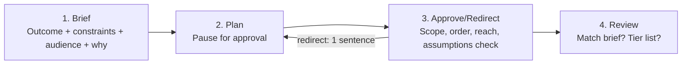

# 📘 Chapter 4 — General Agents on the Web: A Crash Course

> [!NOTE]
> **Source:** [agentfactory.panaversity.org/docs/general-agents-web-crash-course](https://agentfactory.panaversity.org/docs/general-agents-web-crash-course)
> 
> · **Track:** Claude Certified Associate — Foundations

---

## 📑 Table of Contents

- [Part 1: The Shift](#part-1-the-shift)
  - [1. Same Address, Do Alag Cheezein](#1-same-address-do-alag-cheezein)
  - [2. Remote Session — Tab Sirf Window Hai](#2-remote-session--tab-sirf-window-hai)
  - [3. Do Vendors, Aik Shape](#3-do-vendors-aik-shape)
- [Part 2: The Surface](#part-2-the-surface)
  - [4. Account Spine](#4-account-spine)
  - [5. Teen File Tiers](#5-teen-file-tiers)
  - [6. Connectors on the Web](#6-connectors-on-the-web)
  - [7. The Gate in Your Pocket](#7-the-gate-in-your-pocket)
- [Part 3: Working Unwatched](#part-3-working-unwatched)
  - [8. Delegation Loop](#8-delegation-loop)
  - [9. Scheduled Tasks](#9-scheduled-tasks)
- [Part 4: Choosing, and the Open Path](#part-4-choosing-and-the-open-path)
  - [10. Web, Desktop, ya Terminal?](#10-web-desktop-ya-terminal)
  - [11. Open Path — No Vendor Cloud](#11-open-path--no-vendor-cloud)
  - [12. Yeh Surface Kya Nahi Kar Sakta](#12-yeh-surface-kya-nahi-kar-sakta)
- [One-Line Recap](#-one-line-recap)

---

## Part 1: The Shift

### 1. Same Address, Do Alag Cheezein

<!-- ^ Placeholder for figure: "Harness Wars — Hero Graphic" -->

July 2026 mein Anthropic aur OpenAI ne apne agent surfaces ko browser mein la kar khara kar diya — **Claude Cowork** (claude.ai pe remote session) aur **ChatGPT Work** (chatgpt.com pe Chat mode ke sath aik naya mode).

> [!IMPORTANT]
> **Simple test:** *"Agar main type karna band kar doon, kya kaam bhi ruk jayega?"* Chat box → **haan, ruk jata hai**. Agent surface → **nahi, chalta rehta hai**. Yehi line har company/product ko pehchanne ke liye kaafi hai.

<!-- ^ Placeholder for figure: "Same Address, Two Things" -->

> [!NOTE]
> Chat box **synchronous** hai (aap wait karte ho, phir turn khatam). Agent run **delegated** hai (start hone ke baad outcome ki taraf move karta rehta hai, aapke agle turn ki zaroorat nahi).

---

### 2. Remote Session — Tab Sirf Window Hai

**Do jagah jahan agent reh sakta hai:**
- **Aapke machine pe** (desktop apps/terminals) — laptop band, kaam pause.
- **Vendor ke servers pe** (yeh chapter) — browser tab sirf **window** hai, runtime nahi.

<!-- ^ Placeholder for figure: "Remote Session — Window, Not Runtime" -->

> [!TIP]
> **3 consequences:** Tab band karo → kaam chalta rehta hai · Phone se session kholo → same session, copy nahi · Scheduled task band tab se bhi fire hoti hai.

> [!WARNING]
> Ek honest limit: remote session sirf woh cheezein reach kar sakta hai jo vendor ke machines reach kar saktay hain (connectors, task filesystem, platform files) — **aapke local hard drive, desktop apps, ya browser profile tak nahi** (jab tak desktop app bridge na bane).

---

### 3. Do Vendors, Aik Shape

<!-- ^ Placeholder for figure: "Two Vendors, One Shape" -->

**6 Parts har agent product mein:**

| Part | Matlab |
|---|---|
| **Heartbeat** | Kaam bina aap ke shuru hota hai — once, schedule, event, ya monitoring |
| **Connectors** | Permission-scoped reach — aapke real apps tak |
| **Run-until-done loop** | Outcome diya jata hai, agent steps ke through kaam karta hai |
| **State spine** | Memory jo runs/devices ke darmiyan bachi rehti hai |
| **Human gate** | Risky decisions insaan ke paas atay hain — phone pe |
| **Body** | Jahan run ka kaam actually hota hai — finished artifacts banaye jatay hain |

> [!IMPORTANT]
> **Shape seekho, tool nahi.** Jab do independent companies same parts pe aa jayein, yeh proof hai ke **parts hi discipline hain, products sirf packaging.** Naya agent product dekh kar bhi aap ise seh minute mein samajh saktay ho.

<!-- ^ Placeholder for figure: "Cowork vs ChatGPT Work" -->

> [!NOTE]
> **Sabse structural farak:** OpenAI ka coding agent (Codex) same app mein (desktop pe separate view). Anthropic ka Claude Code **wholly separate surface** hai. Baqi farak sab packaging hai (model, plan, connector directory ka naam).

---

## Part 2: The Surface

### 4. Account Spine

Sessions aur files aapke account mein save hotay hain — kisi bhi device se same kaam mil jata hai. Yeh **account spine** hai — free continuity, lekin **vendor ki custody mein.**

> [!TIP]
> **3 habits:** Sessions ko work-product jaisa naam do ("Acme renewal brief," "Quick question" nahi) · Aik session = aik workstream · Dead sessions prune karo (context cost karta hai).

---

### 5. Teen File Tiers

<!-- ^ Placeholder for figure: "The Three File Tiers" -->

Yeh course ka **signature concept** hai:

1. **Tier 1 — Task Filesystem:** Temporary scratch space, session khatam hote hi wipe. Kabhi bhi permanent mat samjho.
2. **Tier 2 — Platform Storage:** Account pe permanently saved. Task/tab se bach jata hai, lekin **vendor ki custody** mein rehta hai.
3. **Tier 3 — The Exit:** File platform se nikal kar aapke control mein aa jati hai (connector save, download, local write, repo commit). **Sirf yehi tier aapka system of record hai.**

> [!IMPORTANT]
> **Is poore course ki sabse important line:**
> **"Finished work exits the platform. Everything else may stay."**

> [!WARNING]
> Har deliverable-producing brief ke end pe yeh line add karo:
> *"End by listing every file you created and where each one landed: temporary working space, platform storage, or a system I control."*

---

### 6. Connectors on the Web

Web pe connectors **double weight** uthatay hain — reach bhi, aur tier-3 exit door bhi.

> [!WARNING]
> - **Read scope ≠ send scope** — mail read access summarize karne dega, lekin send/write alag, bara grant hai.
> - **Untrusted content hamesha careful mode mangta hai** — email/PDF/webpage mein chupi instructions ho sakti hain (**prompt injection**). Agar plan mein aisa connector action nazar aaye jo aap ne nahi manga, approve mat karo.

---

### 7. The Gate in Your Pocket

**Human gate** ab phone pe aata hai — kyun ke aap screen pe nahi, kahin aur ho rahe ho.

> [!IMPORTANT]
> **Phone gate hai, workbench nahi.** Design/review wahan mat karo — sirf approve/redirect/stop karo.
>
> **"The gate did not move. The doorbell had to."** — Ek unseen escalation delayed decision ban jati hai, jo kabhi kabhi default decision ban jati hai.

> [!TIP]
> **Rehearsal karo:** Ek harmless test task banao jo approval maangay, walk away karo, confirm karo notification phone pe pohanchi. **Aik alarm jo aap ne kabhi suna nahi, sirf ek rumor hai.**

---

## Part 3: Working Unwatched

### 8. Delegation Loop

<!-- ^ Placeholder for figure: "The Delegation Loop" -->

**4 Steps:**

1. **Brief** — sirf query nahi, poora assignment: outcome, constraints, audience, why.
2. **Plan** — "Lay out your plan first, and pause for my approval." Yeh **aapka sirf intercept point** hai, kyun ke aap walk away karogay.
3. **Approve/Redirect** — 4 cheezein check karo: Scope, Order, Reach, Assumptions. Galat ho to 1-sentence redirect do, restart mat karo.
4. **Review** — brief ke end pe: clarifying questions poochne do, contradictions flag karwao, files+tiers list karwao.

> [!WARNING]
> **Anti-pattern:** Is surface ko "superpowers wala chat box" samajh kar one-line prompt fire karna. Vague brief + long unwatched run = decisions compound hoti hain aap dekhne se pehle.

---

### 9. Scheduled Tasks

<!-- ^ Placeholder for figure: "Four Heartbeats" -->

**Har scheduled task ke 4 jawab likho:**
1. **Kya karay?** (empty-case bhi likho — "no new items" ka note)
2. **Kya touch karay?** (files/storage, by name)
3. **Kya reach kar sakay?** (connectors, narrowest scope)
4. **Kab chalay?** (cadence — "Monday 8am" ka matlab hai *around* 8am)

> [!IMPORTANT]
> **3 Rules:**
> - Jo kaam walk-away pe trust nahi karte, usay schedule mat karo — pehle hath se, phir unwatched, kai baar chalao
> - Metered usage ka hisaab likh kar rakho — plan limit se pehle count karo
> - **"A run that completed is not a task that succeeded."** Task apna khud success-signal report karay (kitne items process huay), sirf "ran" kaafi nahi

> [!NOTE]
> Is course ki **ceiling: schedules jo REPORT karti hain.** Schedules jo **ACT** karti hain (send/update/decide) — unke liye checker, stopping condition, state chahiye, jo [Loop Engineering] mein aata hai.

---

## Part 4: Choosing, and the Open Path

### 10. Web, Desktop, ya Terminal?

<!-- ^ Placeholder for figure: "Pick by What the Work Touches" -->

**Rule: pick by what the work touches.**

| Kaam ko chahiye | Surface |
|---|---|
| Connector + document work, machine-off continuity | **Web** |
| Local files, desktop apps, browser session | **Desktop** (Cowork/OpenWork) |
| Code, repos, command line | **Coding agents** |
| Regulated data (PHI, privileged, financial) | **Koi nahi, abhi nahi** — pehle compliance se likhit jawab lo |

> [!WARNING]
> **Regulated data** kabhi is surface pe nahi jani chahiye jab tak compliance likhit approval na day — Tier 1 aur 2 **vendor ki custody** mein hotay hain, by definition.

---

### 11. Open Path — No Vendor Cloud

**Do open paths:** **OpenWork** (self-hosted worker, aapki apni infrastructure) aur **OpenCode** (apna cron/GitHub Actions scheduler).

> [!TIP]
> **Trade-off:** Vendor surface = furnished office (sab kuch ready, lekin unki custody/rules mein). Open path = khali kamra jo khud furnish karna parta hai (zyada kaam, lekin **custody + choice** aapki).

---

### 12. Yeh Surface Kya Nahi Kar Sakta

> [!IMPORTANT]
> **Surface kaam ko behtar nahi banata — sirf unattended banata hai.** Quality lever hamesha aapke side pe hai: brief, plan review, tier decision, gate test, walked-before-scheduled rule.
>
> **Ek discipline jo sab kuch protect karti hai:** kabhi bhi kuch aisa mat rehne do jo *sirf* platform pe ho. **Tier 3, hamesha, har us cheez ke liye jo aap kho nahi saktay.**

---

## 🎯 One-Line Recap

> [!IMPORTANT]
> Chat box design karne ki jagah hai, agent surface chalane ki. **Same 6 parts** har naye product mein dhoondo, files ko hamesha **Tier 3** tak pohanchao, delegation loop (**Brief → Plan → Approve → Review**) follow karo, aur scheduled tasks ko sirf **report** karne do jab tak Loop Engineering na seekho. Shape seekho — address badalta rahega.

**Web (rented harness) vs Later Courses (built harness)**

---

# General Agents on the Web: A Crash Course

**GIAIC · The AI Agent Factory · Exam Preparation · Claude Certified Associate — Foundations · 2026**

**Built By Ismail Ahmed Shah | GIAIC 2026**

Made with ❤️ for the AI Builders Community

