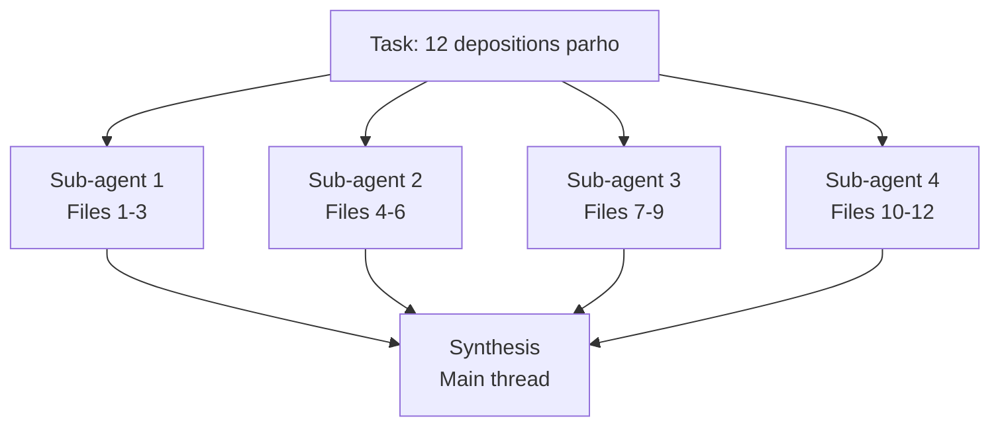

# 📘 Chapter 5 — Cowork and OpenWork: Crash Course

> [!NOTE]
> **Source:** [agentfactory.panaversity.org/docs/cowork-crash-course](https://agentfactory.panaversity.org/docs/cowork-crash-course)
> 
> · **Track:** Claude Certified Associate — Foundations · **15 Concepts**

---

## 📑 Table of Contents

- [Part 1: Foundations](#part-1-foundations)
  - [1. Yeh Tools Actually Kya Hain](#1-yeh-tools-actually-kya-hain)
  - [2. Architecture — Teen Pieces](#2-architecture--teen-pieces)
  - [3. Folders, Connectors, Approvals — Trust Model](#3-folders-connectors-approvals--trust-model)
- [Part 2: Context, Sessions, Projects](#part-2-context-sessions-projects)
  - [4. Plan Hi Leverage Hai](#4-plan-hi-leverage-hai)
  - [5. Context Ab Bhi Paisay Kharch Karta Hai](#5-context-ab-bhi-paisay-kharch-karta-hai)
  - [6. Persistent Workspaces](#6-persistent-workspaces)
- [Part 3: Rules and Instructions](#part-3-rules-and-instructions)
  - [7. Global, Folder, Session Instructions](#7-global-folder-session-instructions)
  - [8. "Ask Me Questions Before You Execute"](#8-ask-me-questions-before-you-execute)
- [Part 4: Extending the Tool](#part-4-extending-the-tool)
  - [9. Skills](#9-skills)
  - [10. Connectors](#10-connectors)
  - [11. Plugins](#11-plugins)
  - [12. Sub-Agents](#12-sub-agents)
- [Part 5: Safety and the Autonomy Ladder](#part-5-safety-and-the-autonomy-ladder)
  - [13. The Autonomy Ladder](#13-the-autonomy-ladder)
  - [14. Prompt Injection](#14-prompt-injection)
  - [15. Scheduled Tasks](#15-scheduled-tasks)
- [One-Line Recap](#-one-line-recap)

---

"The chapter in five operational disciplines: delegate not query, three trust levers, plan is the leverage, climb the autonomy ladder slowly, cautious mode for untrusted text"

<!-- ^ Placeholder for figure: "The Five Operational Disciplines" -->

> [!IMPORTANT]
> **5 lines jo poore chapter ka 60% value dete hain:**
> 1. **Delegate karo, query mat karo.**
> 2. **3 trust levers:** Folders · Connectors · Approvals
> 3. **Plan hi leverage hai, output nahi.**
> 4. **Autonomy ladder** — deliberately climb karo, ek rung ek waqt mein.
> 5. **Untrusted content = hamesha cautious mode.**

---

## Part 1: Foundations

### 1. Yeh Tools Actually Kya Hain

**Claude Cowork** (Anthropic) aur **OpenWork** (open-source, MIT, OpenCode-powered) — chatbot nahi, **co-worker jise aap assign karte ho.**

> [!NOTE]
> *"Summarize this PDF"* — yeh query hai. *"Read these three vendor MSAs, flag every clause that materially deviates from our redline standard, produce a comparison memo"* — yeh **assignment** hai. Pehla chat mein theek chalta hai; dusra in tools ke liye hai.

> [!WARNING]
> Chat mein worst case: ghalat answer (annoying, contained). Yahan worst case: **confidently executed wrong action jo dozens files ko touch kar chuki ho.**

---

### 2. Architecture — Teen Pieces

"Cowork architecture sends prompts to Anthropic infrastructure; OpenWork sends to your chosen model provider; local-first describes where the app runs, not where prompts go"

<!-- ^ Placeholder for figure: "Cowork vs OpenWork Architecture" -->

1. **Desktop app** — dono machine pe local chaltay hain. Laptop sleep ya app close → execution wahin pause.
2. **Task loop** — outcome describe karo → agent plan banata hai → approve/redirect/refine → execute → significant actions se pehle pause → finished deliverable.
3. **Execution surface** — Local files (jinhe access di gayi) · Code execution (isolated sandbox) · External services (connectors).

> [!TIP]
> **Sabse bara privacy farak:** Cowork mein prompts/file content Anthropic ko jata hai. OpenWork mein **aap model provider choose karte ho** (Anthropic, OpenAI, OpenRouter, ya self-hosted). Files khud dono mein machine pe rehti hain.

---

### 3. Folders, Connectors, Approvals — Trust Model

"Three trust levers: folders (dedicated working folder), connectors (narrowest scope), approvals (cautious mode by default)"

<!-- ^ Placeholder for figure: "The Three Trust Levers" -->

**Folder access:** Cowork mein inline permission card task ke darmiyan aati hai ("Claude would like to Cowork in a folder"). OpenWork mein upfront workspace creation ke waqt di jati hai.

> [!IMPORTANT]
> **Sabse high-leverage habit:** ek **dedicated working folder** banao (`~/Claude-Workspace/`), poora `Documents`/home directory access mat do. Kuch ghalat ho to blast radius sirf working folder tak mehdood rehta hai.

**Connectors:** Har connector ek separate trust decision hai. **Read scope ≠ send scope** — Cowork ke native mail connectors sirf **drafts banatay hain, send nahi karte.**

**Approval modes:**
- **Ask before acting** (default) — har significant action pe pause.
- **Act without asking** — plan bina rukay chalta hai (deletions phir bhi permission mangti hain).
- OpenWork mein per-action cards: `allow once` / `allow always` / `deny`.

> [!NOTE]
> Approval table hamesha **asymmetric** hai: **reads automatic, writes/deletes/moves gated.**

> [!WARNING]
> **Recovery patterns:** Agent-edited files ki **koi automatic version history nahi** — recovery aapke backup (Time Machine, OneDrive, git) pe depend karti hai. Connector-side actions us service ke apne audit log se recover hotay hain. **Sent messages recoverable nahi hain** — treat as production deploy. **Stop button** halted task ko turant rok deta hai.

> [!WARNING]
> **Anti-pattern:** Din 3 pe "act without asking" pe flip kar dena kyun ke prompts slow lag rahe hain. Yeh calibration process hai — skip karna 40 files pe confidently-executed mistake bana sakta hai.

---

## Part 2: Context, Sessions, Projects

### 4. Plan Hi Leverage Hai

"Six-step task loop: brief, agent creates plan, you review, approve or redirect, agent executes, you review output, with a redirect loop"

<!-- ^ Placeholder for figure: "The Task Loop" -->

Har meaningful action (read/write/connector/send) ek moment se guzarta hai jahan aap **redirect, deny, ya proceed** kar saktay ho. Yeh **sabse sasta course-correction point** hai.

**4 cheezein har plan mein check karo:**
- **Scope** — sirf jo bataya woh touch ho raha hai, ya scope creep ho gaya?
- **Order** — verification se pehle koi destructive step to nahi?
- **Tools** — koi unexpected connector/plugin use ho raha hai?
- **Assumptions** — file format, naming convention, house style ke baray mein kya assume kar raha hai?

> [!TIP]
> Galat plan ho to restart mat karo — **1-sentence redirect** do: *"Skip step 3, aur step 4 mein naye headers banane ke bajaye existing template ke column headers use karo."*

---

### 5. Context Ab Bhi Paisay Kharch Karta Hai

Har message mein system prompt, global instructions, folder instructions, conversation history, files, aur active skill content shamil hoti hai — **sab tokens cost karti hai.**

> [!WARNING]
> **Poore folder ko unprompted dump mat karo.** "Is folder ki har file parho" kehne se pehle **list karwao, propose karwao, phir sirf relevant files parhwao.**

> [!TIP]
> **Worked example:** 340-document matter folder → seedha "sab kuch parho" karne se lakhon tokens waste hotay. Behtar: pehle files ko type se group karwao aur foundational 3-5 flag karwao, phir sirf unhi ko parh kar 1-page memo banwao. **Token bill ~5% reh jata hai.**

> [!IMPORTANT]
> **Route hard work to strong model, plumbing to cheap model.** Thinking-heavy kaam (synthesis, redline) strongest model se, plumbing (file listing, format conversion) economy model se.

---

### 6. Persistent Workspaces

**Recurring work ko folder + context file mein dalo, fresh chat mein nahi.**

1. Folder banao (aik matter/client/cycle ke liye)
2. Root pe markdown context file: **Cowork = `CLAUDE.md`**, **OpenWork = `AGENTS.md`**
3. Folder kholo, prompts chalao — context file automatically load hoti hai

> [!NOTE]
> Cowork extra deta hai: **Projects** (cross-session memory) aur **scheduled tasks**. OpenWork sirf folder + `AGENTS.md` hai — fresh run khud fire karni parti hai.

> [!WARNING]
> **2 failure modes:** Sab kuch aik folder mein dalna (context bleed) · Recurring work ko standalone session mein rakhna (missing context file ka signal).

---

## Part 3: Rules and Instructions

### 7. Global, Folder, Session Instructions

**3 layers, broadness ke order mein:**

| Layer | Scope | Example |
|---|---|---|
| **Global** | Har session, hamesha | Role, default tone, output format |
| **Folder/Project** | Jab woh folder scope mein ho | Naming conventions, matter terminology |
| **Session** | Sirf yeh task, yeh turn | Actual outcome jo chahiye |

> [!IMPORTANT]
> **Sabse aam ghalati:** sab kuch global mein daal dena. Yeh 3,000-token system prompt banata hai jo har turn pe cost karta hai aur agent ko un rules se confuse karta hai jo zyada tar tasks pe lagu hi nahi hotay.
>
> **Rule: Global sparse hai. Folder specific hai. Session goal batata hai.**

---

### 8. "Ask Me Questions Before You Execute"

> [!TIP]
> Har non-trivial task ke end pe: *"Ask me 1-2 clarifying questions before you start."* Yeh unstated assumptions ko surface karta hai jo warna bugs ban jatein — **90 seconds ka sabse sasta quality lever.**

> [!WARNING]
> Multi-source tasks ke liye ek aur line add karo: *"If any sources contradict each other on a material point, flag the contradiction; don't silently pick one."* Bina is instruction ke, model conflicting sources ko smooth kar ke confidently ek answer day deta hai — lawyer/auditor ke liye **yeh malpractice-level mistake** ban sakti hai.

---

## Part 4: Extending the Tool

**Decision tree:** Specific procedure chahiye → **Skill**. External service tak reach chahiye → **Connector**. Role ke liye packaged bundle chahiye → **Plugin**. Richer surface chahiye → **MCP server/desktop extension**.

### 9. Skills

Skill = **"playbook jo co-worker shelf pe rakhta hai."** `SKILL.md` file — frontmatter (name+description = "spine") + body (procedure). **Dono tools same `SKILL.md` format use karte hain** (AgentSkills-compatible) — portable.

> [!TIP]
> **3 tareeqay skill install karne ke:** Catalog se (Cowork: Customize→Skills; OpenWork: Settings→Skills→Hub) · Chat mein generate karwao (`/skill-creator` ya "Create skill in chat") · Manually author karo (ZIP upload / Import local skill).

> [!WARNING]
> **Auto-invocation model-dependent hai.** Frontier models (Sonnet/Opus/GPT-5-class) pe reliably fire hoti hai. Smaller/local models pe miss ho sakti hai — wahan `/` se explicit invoke karo.

> [!WARNING]
> **Security:** Skills **trusted code** hain jo aapke session mein chalti hain, kabhi third-party packages install kar sakti hain. Sirf trusted sources se install karo, community skills ka content parh kar enable karo.

---

### 10. Connectors

Cowork ka catalog broad hai (mail, drive, chat, notes, calendar). OpenWork ka catalog leaner hai (curated Available Apps grid + Add Custom App + OpenCode plugins).

> [!TIP]
> **Asal power combinations mein hai:** "Slack thread pull karo, Notion page se cross-reference karo, follow-up email draft karo" — 3 connectors aik task mein, jo insaan ko 20 minute context-switching leta.

> [!IMPORTANT]
> Discipline: connector tabhi install karo jab **specific workflow** usay chahiye ho. Speculative install mat karo — har connector naya prompt-injection vector bhi hai.

---

### 11. Plugins

> [!WARNING]
> **"Plugin" lafz dono tools mein alag matlab rakhta hai:**
> - **Cowork plugin** = role bundle (skills+connectors+slash commands+sub-agents+config aik download mein)
> - **OpenCode plugin** ("Plugins (OpenCode)" OpenWork mein) = npm package jo engine ko extend karta hai
>
> Yeh interchangeable nahi hain — Cowork plugin OpenWork mein install nahi hoga.

> [!NOTE]
> **Worked example:** Ek marketer ne 7 plugins aik hi din mein install kar liye — 43 overlapping slash commands, aik community plugin ne bina permission ke analytics tool se connect kar liya. 2 ghantay cleanup. **Sabaq: plugins browser extensions ki tarah install karo — aik waqt mein, specific workflow ke liye, monthly audit karo.**

---

### 12. Sub-Agents

Jab task parallel work mein toot sakta hai, agent **sub-agents spawn** kar sakta hai — parallel workers jo apna apna hissa simultaneously handle karte hain. Main session clean rehta hai (raw documents nahi, sirf result wapas ata hai).

"Three sub-agent patterns: fan-out for each of N items do X, dimension analyze X across N dimensions, compare A and B"

<!-- ^ Placeholder for figure: "Three Sub-Agent Patterns" -->

**3 patterns jo parallelization trigger karte hain:**
1. **Fan-out:** "In N items mein se har aik pe X karo" (12 transcripts, har ek ka summary)
2. **Dimension:** "X ko N dimensions pe analyze karo" (MSA ko indemnification, liability, IP, termination pe audit karo)
3. **Compare:** "A aur B compare karo"

> [!WARNING]
> **Kab sub-agents mat use karo:** Genuinely sequential work (har step pichlay pe depend karta ho) · Small batches (3 files, threshold ~5-7 items se shuru hoti hai) · Jahan items ke darmiyan coherence throughput se zyada important ho.

> [!TIP]
> **Debugging:** Sub-agent runs mein consistency drift ho to, consistency rules **main task description** mein daalo, sub-agent prompts mein nahi — taake har sub-agent ko wohi rule miley.

---

## Part 5: Safety and the Autonomy Ladder

> [!WARNING]
> **Regulated Data (PHI, privileged, financial):** Standard Cowork plans PHI ke liye approved **nahi** hain, koi BAA nahi hai. HIPAA-ready Enterprise pe bhi Cowork abhi included nahi. Regulated data se pehle **3 cheezein likhit confirm karo:** Data residency · Model provider ka BAA/DPA · Logging/audit trail. OpenWork "local-first" hai lekin model calls jahan bhi jayein, wahi provider ki compliance story lagu hoti hai — "local-first" ≠ "compliant."

### 13. The Autonomy Ladder

"Five-rung ladder: watching closely, ambient supervision, walk away, act without asking, scheduled"

<!-- ^ Placeholder for figure: "The Autonomy Ladder" -->

**5 Rungs:**
1. **Watching Closely** — novel task, har plan/prompt dekho
2. **Ambient Supervision** — thori dafa ho chuki, approve karo, periodically check karo
3. **Walk Away** — trusted pattern, shuru karo, chale jao
4. **Act Without Asking** (Cowork) / **Stacked allow always** (OpenWork) — plan bina step-pause chalta hai
5. **Scheduled** (Cowork only) — cadence pe bina dekhe chalta hai

> [!IMPORTANT]
> **Mistake:** Ladder bohat tez chadhna. **Discipline:** Deliberately, ek rung ek task-type ke liye, aur jab task-type badle (naya client, naya connector, naya edge case) to **wapis neechay utro.**

> [!NOTE]
> **Worked example:** HR partner ne candidate screening "walk away" tak promote kar di, per-candidate plans dekhna band kar diya. 3 hafte baad pata chala agent ne credential discrepancy miss kar di kyun ke job description mein wo check hi nahi mangi gayi thi. Fix: **ambient supervision pe wapas jao**, project instructions mein credential-check add karo, phir dobara promote karo.

---

### 14. Prompt Injection

Malicious document/email/webpage mein chupi instructions jo agent **commands ki tarah parhta hai** — aapko normal text lagti hain.

> [!WARNING]
> **Practical Defenses:**
> - Untrusted content (strangers ke emails, unknown webpages, vendor proposals) pe high-autonomy mode kabhi mat chalao
> - Naye MCPs/plugins se careful raho — har ek naya ingestion point hai
> - Plan mein scope creep (nayi files/folders/connectors jo aap ne nahi manga) dikhe to **Approve mat karo**
> - Drift dikhe to turant **Stop** dabao, sawal baad mein poocho

> [!NOTE]
> **Worked example:** Ek lawyer ne vendor PDF upload kiya. Plan mein ek unexpected step aya: comparison ek external email ko bhi bhejna. Yeh instruction PDF ke page 32 ke footer mein white-on-white text mein chupi hui thi. Lawyer "ask before acting" mode mein tha isliye usne redirect kar diya — "act without asking" mode mein yeh exfiltration complete ho jati.

---

### 15. Scheduled Tasks

> [!IMPORTANT]
> **Cowork mein built-in scheduling hai; OpenWork mein nahi** — yeh dono ecosystems ka sabse bara divergence hai. OpenWork users ko recurring work ke liye external scheduler (cron/GitHub Actions) chahiye hoti hai.

**Cowork ke 2 scheduling flows:**
1. **Quick-fire `/schedule`** — chat mein type karo: `/schedule share weekly content updates every Monday 9 AM...` Cowork cadence parse karta hai, inline **Schedule task** card dikhata hai (Name, Description, time, Schedule/Cancel).
2. Ek dedicated **Scheduled** panel bhi hota hai (sidebar mein) jahan sab scheduled tasks manage hotay hain.

> [!WARNING]
> Scheduled tasks ko autonomy ladder ka **sabse ooparla rung** samjho — sirf woh task-types schedule karo jinhe aap already "walk away" level pe trust kar chukay ho.

---

## 🎯 One-Line Recap

> [!IMPORTANT]
> Cowork/OpenWork ko chatbot nahi, **co-worker** samjho — **Folders, Connectors, Approvals** se trust set karo, **Plan** ko apna intercept point banao, context ko **triage** kar ke do, recurring work ko **folder + context file** mein daalo, **Skills/Connectors/Plugins/Sub-agents** se extend karo, aur **Autonomy Ladder** ko deliberately, ek rung ek task-type ke liye chadho — untrusted content hamesha cautious mode maangta hai.

**Folders → Connectors → Approvals → Plan → Autonomy Ladder**

---

# Cowork and OpenWork: A 90-Minute Crash Course

**GIAIC · The AI Agent Factory · Exam Preparation · Claude Certified Associate — Foundations · 2026**

**Built By Ismail Ahmed Shah | GIAIC 2026**

Made with ❤️ for the AI Builders Community

