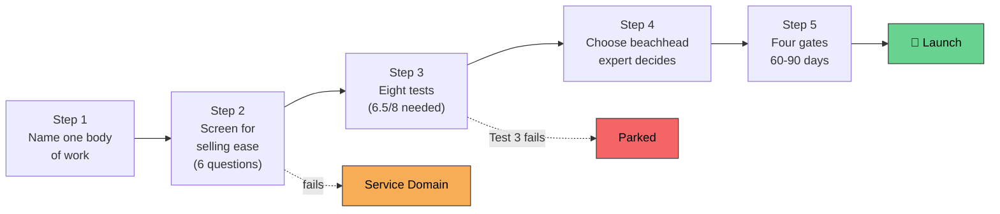

# 🎯 Choosing Your Vertical

> **Course:** GIAIC Final Exam Marathon · Part 2 — Get Ready for the Market
> **Prerequisite:** [The FDE-Agent Factory Model](./fde-af-model-notes.md) → [How to Get Paid](./how-to-get-paid-notes.md)
> **Note:** Yeh Layer 3 ki **selection discipline** hai — 5 steps, 8 tests, 2 unbreakable rules. "Do not guess. Follow a method."

---

## 📑 Table of Contents

- [Core Idea](#-core-idea)
- [Key Terms — Plain English Glossary](#-key-terms--plain-english-glossary)
- [The Two Rules You Never Break](#the-two-rules-you-never-break)
- [Beachhead vs Vertical — The Reversibility Rule](#beachhead-vs-vertical--the-reversibility-rule)
- [Step 1: Name One Body of Professional Work](#step-1-name-one-body-of-professional-work-not-an-industry)
- [Step 2: Screen It for Selling Ease](#step-2-screen-it-for-selling-ease)
- [Why the Method Demands Written Evidence](#why-the-method-demands-written-evidence)
- [Step 3: Run the Eight Tests](#step-3-run-the-eight-tests)
- [Step 4: Choose the Beachhead, Let the Expert Decide](#step-4-choose-the-beachhead-and-let-the-expert-decide)
- [Step 5: Validate Against Four Gates](#step-5-validate-against-four-gates-in-60-to-90-days)
- [After Launch: SoR Always Comes First](#after-launch-the-system-of-record-always-comes-first)
- [Ayesha Runs the Checklist](#ayesha-runs-the-checklist)
- [Six Domain Families](#six-domain-families)
- [The Patterns to Learn](#the-patterns-to-learn)
- [Our Own Portfolio — Three Seats](#our-own-portfolio--three-seats)
- [❌ Common Mistakes](#-common-mistakes)
- [💡 Pro Tips](#-pro-tips)
- [🧠 Memory Tricks](#-memory-tricks-yaad-rakhne-ke-tareeqe)
- [📌 One-Line Chapter Summary](#-one-line-chapter-summary-table)

---

## 🎯 Core Idea

> **One sentence:** *Sab se bara market mat choose karo — sab se **aasan honest sale** choose karo.*

Ek achi vertical ki 3 cheezein: **success measure ho sake shuru hone se pehle**, **ek real expert** knowledge ke peeche khada ho, **ek shared builder** har customer serve kar sake.

---

---

## 📖 Key Terms — Plain English Glossary

| Word | Plain Meaning |
|---|---|
| **Vertical** | Ek professional AI business — ek dafa banti hai, kai companies ko becha jaata hai |
| **Beachhead** | Vertical ke andar pehla narrow segment jahan aap build karte ho |
| **Corpus** | Governed source material jise agents cite karte hain |
| **Expert twin** | Domain expert ki teaching, AI mein encoded |
| **Builder** | Shared tool jo domain ke AI Workers manufacture karta hai |

---

## The Two Rules You Never Break

> ⚠️ **Rule 1 — The Launch Rule:** Vertical bina committed domain expert ke launch nahi hoti. Expert twin hi vertical ka product hai. Bina expert ke sirf ek corpus hai (documents ka collection).

> ⚠️ **Rule 2 — The First-Job Test:** Best first job (Digital FTE ke liye) ki 4 properties: **Repeats** daily/weekly, **Output measurable** hai, **Supervisor already reviews** yeh kaam aaj, **Mistakes fixable** hain.

> 📌 **Key Takeaway:** Is poore page ka maqsad hi in do rules ko protect karna hai — abhi check karna, ek saal baad discover karne se **bohot sasta** hai.

---

## Beachhead vs Vertical — The Reversibility Rule

> **📌 Core Line:** *Galat beachhead 3 mahine ka nuksaan karti hai; galat vertical 1 saal ka.*

| | Beachhead | Vertical |
|---|---|---|
| **Change karna** | Aasan — sab kuch same vertical ke andar rehta hai | Mushkil — corpus, builder rules, customer relationships sab isi ke andar hote hain |
| **Decision speed** | Jaldi choose karo | Bohot dhyan se choose karo |

---

## Step 1: Name One Body of Professional Work, Not an Industry

> ❗ **Important Note:** "Banking" vertical nahi hai. "Healthcare" vertical nahi hai — yeh **industries** hain. Industry mein bohot kaam ki types hoti hain; poori industry ki SoR ek library hoti, corpus nahi — koi ek expert uske peeche khada nahi ho sakta.

> ✅ **Simple Test:** Kya aap ek insaan imagine kar sakte ho jiski **poori career** yehi kaam ho? Agar haan → itna narrow hai. Agar "well, kai tarah ke log" → aapne industry naam liya hai, chhota karo.

**Cut It Smaller Examples:**
| Industry | Segment | One Body of Work |
|---|---|---|
| Healthcare | Revenue-cycle management | Medical coding review |
| Customer support | Technical support | Tier 1 incident resolution |
| Banking | Trade finance | Document checking |

---

## Step 2: Screen It for Selling Ease

> 📌 **Goal:** Sab se **bara market** nahi, sab se **aasan sale**. 6 questions, har ek 0-10, phir average lo.

| # | Question | Kyun Matter Karta Hai |
|---|---|---|
| 1 | Success ek main number se define ho sakta hai? | Contract of success chahiye — starting + target number, +2-3 guardrail numbers |
| 2 | Buyer already isi problem pe paisa kharch karta hai? | Existing spending redirect karna naye budget se bohot aasan hai |
| 3 | Pehli deployment tak raasta kitna clear hai? | Har regulatory gate score ghata deta hai — months add karta hai |
| 4 | Knowledge legally mil sakti hai? | Public laws easiest; private platform policies jo bina notice ke badalti hain, sab se mushkil |
| 5 | Expert aapke network mein probably exist karta hai? | Confirmed nahi, "probably" — Step 4 pe confirm hoga |
| 6 | Ek builder har customer serve kar sakta hai? | Model ka strict rule: ek builder per domain, kabhi separate copy per customer nahi |

> ⚠️ **Warning — Scoring Anchors:** 0-2 (no evidence/severe barrier) → 3-4 (weak, major problems) → 5-6 (possible, uncertain) → 7-8 (strong, solvable) → 9-10 (confirmed, unusually clear). **Har score ke saath ek evidence sentence likho — sentence ke bina score sirf feeling hai.**

> ❗ **Threshold:** **6/10 ya zyada → continue.** Neeche → exit lo.

### The Two Honest Exits

| Exit | Kab | Kya Karo |
|---|---|---|
| **Service Domain** | Q1+Q2 high, baaqi fail | Layer 1 SoR builds + Layer 4 engagements se serve karo, kamao. Trio mat banao |
| **Parked** | Broadly fail | Likh do kya badalna chahiye taake dobara dekha ja sake |

> ✅ **Best Practice:** Service domain **kamzor outcome nahi hai** — graduate earning ladder Layer 1 se hi shuru hoti hai. Zyada tar graduates ko pehle service domains mein kamana chahiye, vertical baad mein choose karna chahiye — real experience ke saath.

---

## Why the Method Demands Written Evidence

> Yeh strict rules style-preference nahi hain — **metacognition** ki science inhe support karti hai (checking your own thinking before acting).

| Finding | Kya Kehta Hai |
|---|---|
| **Confidence ≠ Accuracy** (Steve Fleming, UCL) | Kuch log jaante hain jab woh galat honge, kuch nahi — evidence sentence confidence test karta hai, feel nahi |
| **Overconfidence learning rokti hai** (PNAS study) | Sab se dogmatic log extra information least maangte hain, jab unhe sab se zyada zaroorat hoti hai |
| **Humility forecasting mein intelligence se jeetti hai** (Grossmann) | Humble experts smarter-but-prouder logon se behtar predict karte hain, kyunke woh views zyada update karte hain |

> 💡 **Tip — Third Person Trick:** "Meri vertical" mat likho — likho "ek graduate is domain ko consider kar raha hai," aur us graduate ke evidence ko reviewer ki tarah score karo. Yeh apni khud ki excitement ka reviewer banata hai.

---

## Step 3: Run the Eight Tests

> Screen poochta hai: **kya yeh domain bikta hai?** Eight tests poochte hain: **kya yeh domain ek trio carry kar sakti hai?**

Scoring: Pass = 1, Partial = 0.5, Fail = 0. **6.5/8 chahiye continue karne ke liye.**

> ⚠️ **The Override Rule:** **Agar Test 3 fail ho, vertical evaluation khatam.** Total score matter nahi karta — launch rule tod nahi sakte.

| # | Test | Evidence Chahiye |
|---|---|---|
| **1** | Corpus shape | 10 sources, 3 unbreakable rules, 3 complete procedures naam karo |
| **2** | First Workers | 3+ Digital FTEs jo first-job test pass karein, har ek ka starting number + human reviewer role |
| **3** ⚠️ | **Expert availability** | Ek named insaan jo apni persona + material license kare, rights-cleared. **Deadline do — list khaali ho to jawab mil gaya** |
| **4** | Governing rules | Jurisdictional: country/regulator/versioned rules. Non-jurisdictional: professional frameworks/standards |
| **5** | Market & economics | Kaun buy karta hai, kitne buyers, purchasing kitna mushkil, recurring revenue? **Paisa ke numbers invent mat karo** |
| **6** | Governance feasibility | Corpus ka owner, versions, reviews, access control **mahinon mein**, saalon mein nahi |
| **7** | Competitive position | Kaun already serve karta hai? "Why you, not our vendor?" ka honest jawab |
| **8** | Regulatory gate | Regulator ke rules touch karte hain? Safe default: **preparation and recommendation** — Worker prepare/recommend, named human approve/act |

> ❗ **Fail Route:** Test 3 fail → wapas Step 2 ke do exits (service domain agar sells, warna parked).

---

## Step 4: Choose the Beachhead, and Let the Expert Decide

> Ek profession-sized vertical mein kai bodies of knowledge hoti hain. **Sab kuch ek saath mat banao.** Beachhead choose karo — sab se clear knowledge, sab se checkable first Worker, sab se short path to signed contract.

> 📌 **Tie-Breaker Rule:** Do beachheads equally achi lagti hain? **Expert decide karta hai.** Launch rule hi deciding factor hai comparable segments ke beech. (Yeh buyer evidence ko replace nahi karta — committed expert jahan koi buy hi nahi karta, woh phir bhi failed screen hai.)

> ⚠️ **The Rights Basis Rule:** *"Owning a book is not a license to serve that book through a system."* Har corpus source ki documented rights basis chahiye — **5 options**: public domain, open license, existing commercial license, direct written permission, ya completed replacement plan.

> ❗ **Important Note:** Publisher "no" bole aur backup plan na ho → **yeh beachhead ko marta hai, vertical ko nahi.** Doosra segment pick karo, vertical rakho.

---

## Step 5: Validate Against Four Gates in 60 to 90 Days

> Validation ka ek hi maqsad: **guesses ko facts se replace karna.** Yeh vertical **build karne ka waqt nahi** — yeh prove karne ka waqt hai ke woh build karne layak hai.

**Rule: All four gates, ya no launch.**

| Gate | Kya Chahiye |
|---|---|
| **1 — Expert signed** | "Principle mein razi" nahi — **signed**. Persona license, rights-cleared material, revenue share, platform terms |
| **2 — Rights basis confirmed** | Har third-party source ki written rights basis, ya complete backup plan |
| **3 — Named sponsor + drafted contract** | Ek company, ek named executive sponsor, drafted contract of success (starting/target number, acceptance criteria, forbidden actions) |
| **4 — Real quotes, not guesses** | Quoted license costs, real purchasing timeline, staffing plan — koi invented number launch decision tak nahi pohanchta |

> ❗ **Important Note:** 3 gates pass, excitement pe launch nahi hota — 4th gate window ke andar complete karo, ya Step 4 pe wapas jao blocking gate likh kar.

---

## After Launch: The System of Record Always Comes First

> **Trio ka order fixed hai: Domain SoR pehle. Hamesha.** Kyun? Kyunke baaqi do isi pe khade hote hain — expert twin **isi se** sikhata hai, domain builder Workers ko skills deta hai jo **isi mein** point karti hain.

> ⚠️ **Warning:** Twin ya builder pehle banao, unke paas kuch trusted parhne ko nahi hoga — agents **guess** karenge, aur **agents jo guess karte hain, becha nahi ja sakta**.

### One Source, Two Readers

| Reader | Kaise Parhta Hai |
|---|---|
| **Humans** | Website ki tarah — Markdown, Docusaurus se published |
| **Agents** | Same content, MCP se — pgvector se indexed (meaning se search), MCP tools se served (exact section fetch/cite) |

> 📌 **Key Takeaway:** Content **do baar nahi likha jaata** — ek governed source, dono readers ko serve karta hai. Governance (owner, review, versions, access) **content load karne wale hafte mein hi** set karo, baad mein nahi.

---

## Ayesha Runs the Checklist

Poora page ek chhoti kahani ban jaata hai:

| Candidate | Screen | Result |
|---|---|---|
| **Customer Support** | Sab se high | Test 3 fail (knowledge har client ke apne documents mein, koi support expert with written material nahi) → **Service Domain** |
| **E-commerce Operations** | — | Test 4 fail (rules = marketplace policies jo bina notice badalti hain) → **Parked** |
| **Accounting** | 8/10 screen, 7.5/8 tests | Test 3 jeeta: **aunt**, 20 saal practice, apna written material → **Beachhead: Audit working papers** |

> 📝 **Outcome:** 60 din baad — signed partnership with aunt, licensing answer for every corpus source, mid-size firm sponsor with drafted contract, real quoted costs. **4 gates. Launch.** Pehla build: Accounting SoR. Pehla engagement: working-paper file, 4 ghante → 40 minute.

---

## Six Domain Families

> Domains isi family mein **isi tarah fail** karte hain. Family seekho, kisi bhi non-listed domain ko score kar sakte ho.

| Family | Pattern | Top Examples (selling ease) |
|---|---|---|
| **1 — Money & Numbers** | Success = money number, contract of success likhna aasan | Sales (9), Accounting (8), Tax practice (8) |
| **2 — Documents & Rules** | Kaam = document check karna written rules ke against | Medical billing (7.5), Trade documentation (7) |
| **3 — Operations** | Numbers aasan, lekin knowledge har company ke andar (shared corpus nahi) | Customer Support (9.5, **fails Test 3**), E-commerce Ops (8, **fails Test 4**) |
| **4 — People** | Measurable parts + sensitive parts | Recruitment (7.5), HR (7), Real estate (7) |
| **5 — Hard-Mode** | Bade prizes, dheeme doors — strong on tests, weak on screen | Corporate Banking (4), Healthcare (4) |
| **6 — Shrinking (Warning)** | General model already core task kar deta hai bina corpus ke | Translation (6, falling), Data annotation (4, falling) |

> ❗ **Important — Read Every Domain as "in the Agentic AI Era":** "Payroll" ka matlab payroll AI Workers hai (Digital FTEs jo payroll chalate hain, hire ki tarah measured) — payroll software nahi.

---

## The Patterns to Learn

| # | Pattern |
|---|---|
| 1 | Har high scorer ki same 3 cheezein: ek main number, buyer already spending, written rules |
| 2 | Har low scorer ki same 1 cheez: ek dheema door (regulator/procurement/committee) |
| 3 | ⚠️ **Model jo khata hai usse bacho:** agar general model bina corpus/expert/governance ke poora kaam kar deta hai, wahan vertical nahi hai |
| 4 | Screen aur tests **alag cheezein measure** karte hain — na koi akela decide karta hai, **pipeline decide karti hai** |
| 5 | **Agentic era score karo, SaaS era nahi** — "achi software hai?" mat poochho, "AI Worker yeh kaam kar sakta hai, governed corpus ke saath, ek number se prove hote hue?" poochho |

---

## Our Own Portfolio — Three Seats

> Model khud apne upar apply hota hai — **3 seats ek waqt mein**:

| Seat | Kya | Example (July 2026) |
|---|---|---|
| **Prover** | Sab se aasan sale — market mein model prove karti hai | Sales (Launched) |
| **Moat** | Sab se deep expert advantage — copy karna mushkil | Accounting & Finance (In validation) |
| **Option** | Open expert search + deadline se zinda rakha candidate | HR (Conditional) |

> 📌 **Key Takeaway:** Sirf **ek candidate ek waqt mein validation slot** hold karta hai — kyunke har vertical foundation ke bugs multiply karti hai; pattern ek pe prove karo, phir wide karo. Baaqi domains **service domains** (earn while wait) ya **parked** (written condition) hote hain.

---

## ❌ Common Mistakes

| Mistake | Kyun Galat Hai |
|---|---|
| Sab se bara market choose karna | Goal aasan sale hai, bara market nahi |
| Evidence sentence ke bina score dena | Score bina sentence ke sirf feeling hai |
| Test 3 fail hone ke baad bhi total score se launch karna | Test 3 override hai — total score matter nahi karta |
| Sochna ke service domain "failure" hai | Yeh honest, common outcome hai — earning ladder ka Layer 1 |
| Beachhead aur vertical ko same reversibility deni | Beachhead 3-month mistake, vertical 1-year mistake |
| Money numbers invent karna | Invented number empty space se bhi bura hai — apni thinking fix kar deta hai galat basis pe |
| "I"/"my vertical" likhna evidence mein | Third-person framing behtar judgment deti hai (Grossmann) |
| Book/standard "own" karne ko serve karne ka license samajhna | Rights basis alag se documented honi chahiye — 5 options mein se ek |

## 💡 Pro Tips

- 💡 Har score ke saath evidence sentence likho — warna woh feeling hai, score nahi
- 💡 Expert search ko deadline do — khaali list bhi ek jawab hai
- 💡 Money numbers kabhi invent mat karo — quote maango ya khaali chhodo
- 💡 Rights basis publish/index/embed/retrieve/derive/commercial-access — sab uses specify karke publisher se poochho
- 💡 Third-person framing use karo apna khud ka evaluation likhte waqt

## 🧠 Memory Tricks (Yaad Rakhne Ke Tareeqe)

- **5 Steps = Name → Screen → Test → Beachhead → Validate**
- **"Wrong beachhead = 3 months; wrong vertical = 1 year"**
- **Test 3 = override switch** — fail kiya to baaqi score matter nahi karta
- **4 Gates = Signed, Rights, Sponsor, Real Numbers**
- **"SoR always first"** — twin aur builder isi pe khade hote hain
- **3 Seats = Prover (easy sale), Moat (deep expert), Option (open search)**

---

## 📌 One-Line Chapter Summary Table

| Section | One-Line Takeaway |
|---|---|
| Two Rules | Launch rule (committed expert) + first-job test — poora page inhe protect karta hai |
| Step 1 | Industry nahi, ek body of professional work naam karo |
| Step 2 | 6 questions se screen karo, 6/10 threshold, 2 honest exits |
| Step 3 | 8 tests, 6.5/8 chahiye, Test 3 override |
| Step 4 | Beachhead choose karo, tie ho to expert decide karta hai, rights basis document karo |
| Step 5 | 4 gates, 60-90 din, all-or-nothing |
| After Launch | SoR pehle, phir twin, phir builder — one source, two readers |
| Ayesha | Poori method ek kahani mein — service domain, parked, launched |
| Six Families | Money/Numbers aur Documents/Rules top; Operations sells but weak trio; Hard-mode parked; Shrinking = model khata hai |
| Portfolio | 3 seats (Prover/Moat/Option) + service domains + parked candidates |

---

# 🎯 Choosing Your Vertical
### 5 Steps • 8 Tests • 2 Rules • GIAIC Agent Factory

**Built By Ismail Ahmed Shah | GIAIC 2026**

Made with ❤️ for the AI Builders Community

