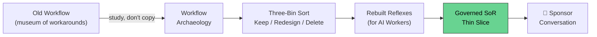
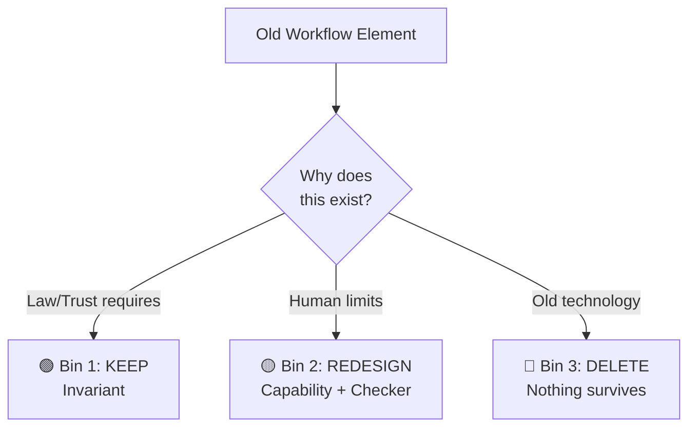

# 🏛️ Designing the Vertical System of Record from First Principles

> **Course:** GIAIC Final Exam Marathon · Part 2 — Get Ready for the Market
> **Prerequisite:** [Choosing Your Vertical](./choosing-your-vertical-notes.md)
> **Note:** Yeh is series ka **sab se bara aur rich chapter** hai — poora method + 2 worked examples (Sales, Accounting). Appendix B (Accounting) ka bilkul aakhri hissa source page pe truncate ho gaya — baaki sab poora hai.

---

## 📑 Table of Contents

- [Core Idea](#-core-idea)
- [Nine Key Words](#-nine-key-words)
- [1. Why the Old Workflow Is the Wrong Blueprint](#1-why-the-old-workflow-is-the-wrong-blueprint)
- [2. First Principles, Applied Asymmetrically](#2-first-principles-applied-asymmetrically)
- [3. Start From the Outcome](#3-start-from-the-outcome-not-the-workflow)
- [4. Workflow Archaeology](#4-workflow-archaeology)
- [5. The Three-Bin Sort](#5-the-three-bin-sort)
- [6. The Source Hierarchy](#6-the-source-hierarchy-which-authority-wins)
- [7. Two Kinds of Content: Authority and Orientation](#7-two-kinds-of-content-authority-and-orientation)
- [8. Map Decisions, Not Departments](#8-map-decisions-not-departments)
- [9. Rules, Judgment, and Permissions](#9-rules-judgment-and-permissions-are-three-different-things)
- [10. Design the Exceptions Before the Normal Path](#10-design-the-exceptions-before-the-normal-path)
- [11. Rebuild the Reflexes](#11-rebuild-the-reflexes)
- [12. Build One Thin Slice, and Prove It](#12-build-one-thin-slice-and-prove-it)
- [The Eight Failure Modes](#the-eight-failure-modes)
- [Ayesha Sorts Her Aunt's Checklist](#ayesha-sorts-her-aunts-checklist)
- [The Seven Templates + Definition of Done](#the-seven-templates--definition-of-done)
- [Appendix A: Sales System of Record](#appendix-a-a-sales-system-of-record-end-to-end)
- [Appendix B: Accounting System of Record (Partial)](#appendix-b-a-general-ledger-system-of-record-partial)
- [❌ Common Mistakes](#-common-mistakes)
- [💡 Pro Tips](#-pro-tips)
- [🧠 Memory Tricks](#-memory-tricks-yaad-rakhne-ke-tareeqe)
- [📌 One-Line Chapter Summary](#-one-line-chapter-summary-table)

---

## 🎯 Core Idea

> **One sentence:** *Purane workflow ko copy mat karo — usse **study** karo taake asal truths mil jayein, phir un truths se **AI Workers ke liye naya** banao.*

> ❗ **Important Note — Timing:** Yeh page **build karne se pehle ki tayyari nahi hai — yeh woh kaam hai jo sale ko mumkin banata hai.** Expert sign ho chuka hai, rights clear hain, koi customer abhi nahi hai. SoR ka pehla slice hi wahi cheez hai jo sponsor conversation kamati hai.

> 💡 **The Chef vs Cook Analogy:** Ek cook recipes follow karta hai. Ek chef ingredients samajhta hai, aur ek naya dish bana sakta hai jo koi recipe describe nahi karti. **First principles thinking = chef ki tarah sochna.**

---

## 📖 Nine Key Words

| Word | Plain Meaning |
|---|---|
| **Corpus** | Governed source documents jo agents cite karte hain |
| **Map** | Index jo batata hai kya knowledge exist karta hai, kab parhna hai |
| **Outcome** | Complete professional result jo value banata hai |
| **Slice** | Ek outcome, poora covered — is page ki building unit |
| **Invariant** | Rule jo har case mein sach rehna chahiye |
| **Evidence** | Information jo conclusion/action support karti hai |
| **Judgment** | Professional decision jo simple rule mein reduce nahi hoti |
| **Reflex** | Complete procedure jo Worker ek poori unit ki tarah load kare |
| **Workflow Archaeology** | Purane kaam ko study karna uske real rules/controls/reasons dhoondne ke liye |

---

## 1. Why the Old Workflow Is the Wrong Blueprint

> Kisi bhi profession ke current workflow ke zyada tar hisse **profession nahi hain — yeh accommodations hain**, purani limits ke workarounds.

### The Five Pre-Agentic Limits

| # | Limit | Kya Ban Gaya |
|---|---|---|
| 1 | Human attention scarce thi | Weekly reports, review queues, month-end batches |
| 2 | Information scattered thi | Data dobara type karna "part of the job" ban gaya |
| 3 | Software kaam samajh nahi sakta tha | Har interpretation-needing kaam insaan ke paas gaya |
| 4 | Departments mein divided organizations | Handoffs jo customer ne kabhi nahi maange |
| 5 | Managers dekh nahi sakte the kaam kaise hua | Blanket approvals unki blindness ki bharpayi ke liye |

> 📌 **Key Takeaway:** In mein se kuch bhi accounting/credit/recruitment **nahi hai** — sab kuch human-only era ka human-only limits ka jawab hai.

---
### Workflow UI Dies First

> Book pehle bhi yeh argument software level pe kar chuki hai: **[The Operating Layer]** batata hai ke SaaS app 3 cheezein hai — system of record + capabilities + workflow UI. Workflow UI sirf isi liye exist karti hai taake insaan capabilities ko haath se chala sake. Jab agent capabilities khud operate kare, **workflow UI sab se pehle martii hai** — uska poora purpose hi insaan tha screen pe.

> 💡 **Same Pattern for a Profession:** Knowledge + evidence + judgment = **record**. Steps aur screens uske around = **human-only era ki workflow UI**. Design karte waqt: **truths carry karo, museum chhod do.**

**The One Question:** *"Agar yeh profession aaj shuru hoti, yeh jaante hue ke AI Workers kya kar sakte hain, human time kahan actually jaata?"*

### The Market Has Already Named This Mistake

> ⚠️ **PwC's US CEO Paul Griggs (July 2026) — 2 Mistakes Companies Make:**
> 1. **AI ko technology change treat karna** — CIO/CTO ko sौंp dena, opportunity miss ho jaati hai (yeh business change hai, technology change nahi)
> 2. **Inefficient process pe AI daalna** — process behtar nahi hoti, sirf zyada complicated ban jaati hai, "process hamesha se buri thi" ki fast report milti hai

> ❗ **Important Note:** Mistake #2 hi is page ka **Failure Mode 2 (AI-readable SOP)** hai — buyer ki taraf se described.

> 📊 **PwC 2026 Global CEO Survey:** **56%** CEOs ne koi financial return report nahi kiya AI se; sirf **~12%** ne revenue **aur** cost dono benefits report kiye. PwC global chairman Mohamed Kande: gap models ki wajah se nahi — **skipped fundamentals** (clean data, sound processes, governance) ki wajah se hai.

> 📌 **Key Takeaway:** Yeh 3 lafz hi is poore page ka professional version hain — **Clean data = source register** (versions, jurisdictions, rights basis), **Sound processes = three-bin sort + reflexes**, **Governance = owner/review/impact record** har source/map/reflex pe.

---

## 2. First Principles, Applied Asymmetrically

> **📌 Definition:** Problem ko basic truths mein tod do (jo hamesha sach rehte hain jab sab habits/assumptions hata do), phir sirf unhi truths se solution banao.

**4-Step Classic Method:** (1) Assumptions likho (2) Basic truths tak todo (3) "Sirf yeh truths jaan kar, main kya banaunga?" poochho (4) Test karo, failures se seekho.

> ❗ **Is Page Ka Addition:** *First-principles **legacy-informed** redesign.* Rebuild karne se pehle, purane kaam ko **dhyan se study karo** (workflow archaeology) — truths wahin chhupe hain, do eras ke workarounds ke neeche dabe hue.

### The Asymmetric Application — 3 Forms, 3 Treatments

| Form | Treatment | Kyun |
|---|---|---|
| **Corpus** (external) | **Given — first principles apply NAHI hoti** | US GAAP/tax law jo kehta hai, wahi hai — yeh jurisdiction ke first principles hain. Faithful service: complete, versioned, citable |
| **Reflexes** | **Scratch se derive hoti hain** | Purane sab reflexes insaan ke liye likhe gaye the — sab human workarounds carry karte hain. Fresh likho |
| **Map** | **Redraw hoti hai** | Purana profession departments/seniority/paper ke around organized tha — Worker ki zaroorat ke around redraw karo |

> ⚠️ **Warning:** Corpus mein 2 tarah ke sources hote hain — **external** (law/standards — given, kabhi redesign mat karo) aur **expert-authored** (methodology/procedures — created, carefully likho/version karo/test karo). Founder jo "tax code rethink" kare, usne innovation nahi ki — confidently galat jawab dene wala system bana diya.

> 📌 **One Governed Home, Three Disciplines:** Corpus = faithful service. Reflexes = fresh writing. Map = redrawn between them.

---

## 3. Start From the Outcome, Not the Workflow

> Purani workflow chhoone se pehle, **professional outcome likho** — jo customer/regulator/reviewer recognize aur judge kar sake.

| Weak Outcome | Better Outcome |
|---|---|
| "Process audit working papers" | "Complete, evidence-backed working paper jo apne conclusion ko support kare, applicable standards follow kare, unresolved exceptions list kare, reviewer approval ke liye ready ho" |
| "Automate invoice review" | "Decide karo invoice valid hai, supported hai, correctly coded hai, authorization limits ke andar hai, aur payment ke liye ready hai ya exception mein bhej do" |

### The Outcome Contract (Template 1)

| Field | Sawal |
|---|---|
| Outcome | Konsa completed result exist karna chahiye? |
| Trigger | Kaunsa event kaam shuru karta hai? |
| Inputs | Kya information chahiye ho sakti hai? |
| Evidence | Result ko kya support karna chahiye? |
| Acceptance criteria | Reviewer kaise decide karega complete hai? |
| Main number + guardrails | Kya improve hona chahiye, kya worse nahi honi chahiye? |
| Forbidden actions | Worker kabhi kya na kare? |
| Final authority | Kaunsa named insaan final decision ka accountable hai? |
| Record | Completion ke baad kya retain hona chahiye? |

> ⚠️ **Warning — Main Number Trap:** Main number **abhi finish nahi hoti**. Expert apni practice se estimate de sakta hai (design ke liye kaafi), lekin **signed contract ka number customer ka hona chahiye**, uske apne workflow mein measured — yehi ek number hai jo buyer verify kar sakta hai. Abhi likho, starting value sponsor conversation ke liye chhodo.

---

## 4. Workflow Archaeology

> Ab, aur **sirf ab**, purane workflow ko study karo — copy karne ke liye nahi, **dig** karne ke liye.

> ✅ **Best Practice:** Boxes/arrows se shuru mat karo. Expert se 5 real files walk-through maango: **normal case, difficult case, failed case, escalated case, ek case jahan experienced professional ne kuch pakda jo beginner miss kar deta**.

> ❗ **Important Note:** Archaeology **expert ki 20 saal ki practice** pe chalti hai, kyunke abhi koi customer nahi hai — yehi wajah hai launch rule expert ko pehle rakhta hai.

### Digging Below the Written Procedure

Poochho: experienced log kya check karte hain jo procedure mention nahi karta? Kaunse steps chup-chaap skip karte hain, kyun? Kaunsa approval hamesha automatic hai, kaunsa kabhi real problem pakadta hai? Kaunse reports banti hain lekin kabhi parhi nahi jatin? Kaunsi spreadsheet chupke se essential ban gayi? Jab procedure fit nahi hoti to sab kis ko call karte hain?

> 📌 **Key Takeaway — The Iceberg:** Written procedure (forms/checklists/sign-offs) sirf **upar** hai. Neeche, **bohot bara**, tacit layer hai (kya experienced log check karte hain, kya skip karte hain, kaunsa approval real problem pakadta hai) — **expert twin yahin se shuru hota hai**.

> 💡 **Tip — Expert Ka Waqt Bachao:** Case walkthroughs record karo. Agent ko recordings se draft likhwao. Phir expert review/correct/approve kare, apni awaaz mein. **Hours of expert review, weeks of expert writing replace kar sakte hain.**

---

## 5. The Three-Bin Sort

> Har element ke liye ek sawaal: **"yeh kyun exist karta hai?"** — sirf 3 honest jawab hain, har jawab ek bin hai.

| Bin | Kya | Example | Action |
|---|---|---|---|
| **1 — Law & Trust** | Regulator/profession require karta hai | Partner ka signature, human approval before money moves, separation of duties | **Keep it — yeh product hai.** Har naya reflex isi ke around banta hai |
| **2 — Human Limits** | Log bhool jaate/thak jaate hain | Tick-and-tie checklist, 3 juniors mein split file, Friday batch | **Redesign** — purpose survive karta hai as Worker capability + checker |
| **3 — Old Technology** | Purane systems baat nahi kar sakte the | Figures dobara type karna, files rename karna, status emails | **Delete** — kuch bhi apni tarah survive nahi karta |

> ⚠️ **Warning — Sharpest Refinement:** *"Control ka purpose Bin 1 hai; uska mechanism usually Bin 2 hai."* Example: "manager har transaction review karta hai" — **purpose** (risk control) invariant hai, keep karo. **Mechanism** (sab kuch review karna) human-limits workaround hai — redesign karo: routine cases automated checks pass karein, manager ka attention sirf exceptions pe jaye.

> ❗ **Two Honest Warnings:**
> 1. **Kuch Bin 1 elements habits jaisi dikhti hain** — retention period, required form, fixed sequence regulator ke rules ho sakte hain. **Chesterton's Fence:** fence hatao mat jab tak na jaano woh kyun banayi gayi thi. **Doubt ho to Bin 1 mein rakho** jab tak governing sources + expert confirm na karein ke redesign/removal safe hai.
> 2. **Sort khud governed content hai** — har sorting decision, reason ke saath, SoR mein record karo. Bina likhe decision, compliance meeting mein defend nahi ki ja sakti.

---

## 6. The Source Hierarchy: Which Authority Wins

> Corpus **given** hai, lekin given **flat nahi** hai. Jab 2 sources disagree karein, Worker ko pata hona chahiye **kaunsa jeetta hai**.

### Typical 7-Rung Hierarchy

1. Current law/regulation
2. Binding professional standards
3. Official regulator interpretations
4. Approved domain policy
5. Expert ke authored procedures
6. Customer-specific policy
7. Historical examples

> ⚠️ **Refinement:** Higher source **sirf tab** jeetta hai jab dono sources **same question** pe baat karein aur dono **case pe apply** hoti hon. **"Relevance kaafi nahi hai. Source applicable bhi honi chahiye."**

> ❗ **Source Register Entry Chahiye:** Publisher, authority class + scope, jurisdiction, version, effective period, rights basis, owner, stable ID.

> 📌 **Cross-Border Rule:** Jurisdiction har authority entry pe ek scope hai. Naya country = **naya build**, apni coverage 1 outcome se shuru — thicker version nahi. Kabhi bhi 2 countries ke rules ek page mein blend mat karo (blended page kisi bhi country mein cite nahi ho sakta).

---

## 7. Two Kinds of Content: Authority and Orientation

> **📌 One Source, Two Readers:** Agents cite karte hain. Humans book ki tarah parhte hain. **Design ek reader ke liye, doosra fail ho jaata hai.**

### Class 1 — Authority (Citable)

3 tests, **kam se kam ek** pass karna chahiye:
1. **Citation test** — kya Worker kabhi reviewer ko yeh cite karega?
2. **Change test** — kya agle saal/jurisdiction mein alag ho sakta hai?
3. **Dispute test** — kya 2 professionals disagree kar sakte hain, isliye authority chahiye?

> ❗ Authority ko full treatment milta hai: register row, rights basis, owner, version, hierarchy mein jagah. **Har entry apni "kind" bhi declare karti hai** (law/standard/contract/policy/methodology/guidance/example) — sab equally strong nahi.

### Class 2 — Orientation (Explaining)

Teeno tests fail karti hai, phir bhi zaroori hai kyunke human reader ko chahiye. Test: **"kya professional reader iske bina lost ho jayega?"**

3 Rules: **Short raho** (poora course nahi) · **Context ki tarah mark karo** (Worker kabhi cite na kare, sirf reading allowed) · **Lightest governance** (stable content, sasta govern karna)

> 💡 **Marking Trick:** Is book ke apne "In plain words" boxes hi orientation ka mark hain — reader ko friendly signal, ingestion pipeline ko machine-readable boundary. **3 validation checks:** binding rule sirf orientation mein na ho; har authority block ki stable ID ho; build fail ho agar page yeh rules todhe.

### The Journal-Entry Page — One Page, Read Twice

| Part | Kya | Kaun Parhta Hai |
|---|---|---|
| **1 — Orientation** | "Journal entry ek business event record karti hai... dono sides equal honi chahiye" | Junior accountant, pehla hafta |
| **2 — Authority** | "$500,000 se upar controller approval chahiye (Policy 4.2)... preparer aur approver alag log hon" | Worker, jo cite karta hai approval route karte waqt |
| **3 — Checker** | Automated test jo reject kare agar debits≠credits | Koi prose nahi, sirf code |

> ⚠️ **Both Failure Directions:** Part 1 delete karo → agent perfect kaam karta hai, lekin naya rep confused ho ke colleague se poochta hai (**human reader fail**). Part 1 ko poore chapter mein expand karo → retrieval Worker ko chapter deta hai, wo likhta hai "guide kehta hai momentum matter karta hai" — reviewer reject karta hai (**agent reader fail**).

### Three Bars for Writing

| Bar | Kiske Liye | Test |
|---|---|---|
| **Simple** | Sab ke liye (readability ek taraf flow karti hai) | "$500,000 se upar approval chahiye" |
| **Exact** | Agent ka bar | "$500,000 se upar (Policy 4.2, version 2026-03)" |
| **Structured** | Worker ka citation bar | Stable IDs, version metadata, authority/orientation mark |

> 📌 **The One Design Target:** *"System of Record ko best handbook ki tarah likho jo apne day-one junior ko dete — phir machine layer add karo jo agents ko cite/check/build karne de."*

> 💡 **Commercial Bonus:** Woh handbook jo junior ke liye achi hai, buyer ke liye bhi convincing hai — bina slide ke.

---

## 8. Map Decisions, Not Departments

> Common mistake: builder 5 departments dekhta hai, 5 agents design karta hai — yeh sirf org chart copy karta hai, kaam behtar nahi karta.

> 📌 **Key Takeaway:** *Decisions* map karo, purane desks nahi. Invoice review ke liye: supplier valid hai? PO exist karta hai? Goods receive hue? Prices match karte hain? Duplicate hai? Threshold cross karta hai? Evidence kaafi hai payment ke liye?

> ✅ **Best Practice:** Yeh decisions departments se **zyada der tak zinda rehte hain** — customer inhe kisi bhi team ko de sakta hai, professional logic reusable rehti hai.

Har decision ke liye jaano: **evidence chahiye, governing source, rule-ya-judgment, kaun/kya decide kar sakta hai.**

---

## 9. Rules, Judgment, and Permissions Are Three Different Things

| Type | Kya Hai | Example |
|---|---|---|
| **Rules** | Clear if-then check | "Limit se upar approval chahiye" |
| **Judgment** | Interpretation chahiye | "Kya evidence kaafi hai?" — supported honi chahiye, **kabhi fake nahi** |
| **Permissions** | Worker kya *kar* sakta hai conclusion ke baad | Read/Search/Calculate/Draft/Recommend/Prepare/Execute (undo-able/not undo-able) |

> ⚠️ **Warning:** *"Judgment ko lambe prompt mein chhupa kar rule mat kaho."* Naam do, expert ki awaaz mein sikhao, test karo.

> ❗ **Safe Default (Regulated Domains):** Worker **prepares and recommends**. Named human **approves and acts**. Zyada authority evaluations + customer governance se **kamaya jaata hai, assume nahi hota**. High-risk rules sirf words se enforce nahi hotin — tool permissions, approval gates, policy checks bhi chahiye.

---

## 10. Design the Exceptions Before the Normal Path

> Routine cases demonstrate karna aasan hai. **Exceptions decide karti hain ke Worker trust ke layak hai ya nahi.**

Failure shapes list karo: missing evidence, conflicting evidence, outdated sources, jurisdiction uncertainty, low-confidence, tool failures, impossible deadlines, conflicting customer instructions.

Har ek ke liye: **detection kaise, Worker kya kar sakta/nahi kar sakta, kisko escalate, escalation mein kya ho.**

> ✅ **The Escalation Bar:** ❌ *"Main continue nahi kar sakta"* — useless. ✅ *"Invoice payment ke liye recommend nahi ho sakti kyunke receipt proof missing hai; PO aur supplier record valid hain, amount tolerance ke andar hai; sirf receiving evidence chahiye; supervisor approval chahiye continue karne ke liye."* — useful, insaan ko **ready-to-make decision** deta hai.

---

## 11. Rebuild the Reflexes

> Yeh poore method ka **first-principles moment** hai. **Purane SOP ko Markdown mein convert karna is method ko follow karna nahi hai** — AI-readable copy bhi purani procedure hi hai, sirf tez.

Har outcome ke liye: invariants state karo, required evidence list karo, automatic checks order karo, judgment points guidance ke saath place karo, permission boundaries set karo, exception paths attach karo, checker/record define karo.

> 📌 **Key Rule — One Outcome, One Reflex:** Reflex ek complete unit ki tarah load hoti hai — Worker ki working attention mein fit honi chahiye. Lambi cheez corpus mein point karti hai, on-demand retrieve hoti hai.

**2 Fresh Questions:**
1. **Batch or event?** Purana Friday review scarce human attention thi. Ab: document aane pe, threshold cross hone pe, ya deadline aane pe act karo. Batch sirf real deadline ke liye rakho.
2. **Sequence?** Purana order org chart follow karta tha. Naya order **evidence aur risk** follow kare.

> ⚠️ **Design vs Contract — Do Alag Numbers:** Expert ki practice se **design** karo (shape + rough cost). Customer ke apne workflow se **contract** karo (baseline jo buyer verify kar sake). Agar redesigned reflex reviewers reject karein → **reflex galat hai, reviewers nahi.**

---

## 12. Build One Thin Slice, and Prove It

> Poori profession attempt mat karo. Ek **complete, trusted slice** banao: 1 outcome + uska contract + hierarchy ka hissa + 1 map + 1 fully derived reflex + permission list + exception list + checker + eval set + governance process.

> 📌 **Thin vs Thick — Sirf Outcomes Count, Corners Nahi:**

| | Meaning |
|---|---|
| **Thin** | 1 outcome, poora covered |
| **Thick** | Kai outcomes, har ek poora covered |
| ❌ **Not Thin** | Sirf clean cases handle karna — yeh **unfinished** hai, thin nahi |

> ⚠️ **3 Cheezein Jo Bara Karti Hain, Thick Nahi:** Agent Factory SoR se method content copy karna (retrieval noise) · Layer 4 customer content upar move karna (contamination) · Orientation ko poore course mein grow karna (unmarked textbook). **Sirf ek completed outcome thicken karta hai — baaqi sab weight hai.**

> ✅ **Test Set Mein Shamil Karo:** Incomplete cases, conflicting evidence, wrong-jurisdiction sources, escalation cases, forbidden-action requests, cases jahan sahi jawab hai "evidence kaafi nahi hai."

**Judge Karo:** Sahi authority/version/jurisdiction use hui? Claims grounded hain, citations exact hain? Saare required checks hue? Permissions ke andar raha? Escalations ne reviewer ka kaam kam kiya? Uncertainty honestly admit ki? Doosra reviewer record se result rebuild kar sakta hai?

> ❗ **Governance Same Week Mein Banti Hai, Baad Mein Nahi.** Har source/map/reflex ko owner + review + approval state + version chahiye. Har change ko **impact record** chahiye (kya badla, kyun, kisne approve kiya, kaunse maps/reflexes/evals affected hain).

**Coverage Register (Template 7):** 1 row per outcome. **Do engines ise fill karti hain:** naya outcome expert ke saath derive karo, ya customer customization 3+ customers pe repeat ho aur promotion review pass kare.

---

## The Eight Failure Modes

| # | Failure | Cure |
|---|---|---|
| 1 | **The document dump** — sirf files + semantic search, koi hierarchy/owner/version nahi | Source hierarchy |
| 2 | **The AI-readable SOP** — purani procedure Markdown mein, duplication/handoffs intact | Three-bin sort |
| 3 | **Technology first** — vector DB + agent framework outcome/invariants se pehle | Start from the outcome |
| 4 | **Rules hidden in prompts** — controls sirf system-prompt sentences, unversioned/untested | Separate rules/judgment/permissions |
| 5 | **Authority before evidence** — Worker ko submit/send/move-money permission evaluations pass hone se pehle | Thin slice + proof |
| 6 | **The happy-path demo** — sirf ek clean example, missing evidence test nahi hui | Design exceptions first |
| 7 | **First-principles theater** — Bin 1 delete kiya kyunke habit lagi, phir compliance meeting mein pata chala woh law thi | Doubt ho to Bin 1 mein rakho |
| 8 | **The unmarked textbook** — full lessons citable authority ki tarah loaded | Two content classes (authority cited, orientation marked+short) |

---

## Ayesha Sorts Her Aunt's Checklist

> Poora page **ek chhoti kahani** mein chal jaata hai — aunt ka 41-item working-paper checklist, 20 saal mein refine hua.

| Step | Kya Hua |
|---|---|
| **Outcome** | "Complete working paper jo standards ke tehet apna conclusion support kare, har material conclusion ko sufficient evidence se link kare, unresolved exceptions list kare, reviewer approval ke liye ready ho" |
| **Archaeology** | 5 real files aunt ke saath, ek failed review wali bhi. Sawaal: "checklist mein na likha hua tum kya check karti ho?" |

### The Sort in Action

| Old Element | Bin | Decision |
|---|---|---|
| "Photocopy supporting invoices" | 3 | Delete — Worker digitally attach karta hai, hash ke saath |
| "Tick and tie every balance" | 2 | Purpose (completeness) = invariant. Mechanism = automated check + exception report — reviewer 5 exceptions parhta hai, 400 lines nahi |
| "Junior prepares, senior reviews, manager reviews" | Split | Standards-required review = Bin 1 (stays). Arithmetic/completeness-catching review = Bin 2 (Worker+checker karte hain) |
| "Partner signs off on going-concern judgment" | 1 | Untouched — standards yeh judgment named human ko assign karti hain |

> 📌 **Result:** 4 ghante → **40 minute**. Woh 40 minute poori tarah us kaam pe kharch hote hain jo sirf insaan sign kar sakta hai. **Har sort decision reason ke saath record hoti hai** — yehi is System of Record ko "agentic-era system" banata hai, scanned binder nahi.

> ❗ **Important Note:** Woh 4 ghante **abhi baseline nahi hain** — yeh aunt ki practice ka number hai, jispe Ayesha ne design kiya. Jab Chicago ka partner apne juniors ka number bataye, **tab** woh baseline banti hai, aur tabhi contract of success draft ho sakta hai.

---

## The Seven Templates + Definition of Done

| # | Template | Kaam |
|---|---|---|
| 1 | **Outcome Contract** | 1 per outcome — workflow study se pehle likha jaata hai |
| 2 | **Sort Record** | 1 row per old-workflow element — permanently SoR mein rehta hai |
| 3 | **Invariants List** | Bin 1, rules ki tarah likha — short rakho |
| 4 | **Source Register** | 1 row per corpus source — rights basis included |
| 5 | **Decision Map** | 1 row per decision — rule/judgment + permission separate |
| 6 | **Exception Entry** | 1 per exception shape — normal path finish hone se pehle |
| 7 | **Coverage Register** | 1 row per outcome per jurisdiction — probe vs covered |

> ❗ **Coverage Register Note:** **Probe** = cheap evidence (koi owner/version/eval set nahi, coverage count nahi hoti). **Covered** = definition of done pass ki.

### ✅ Definition of Done (16-Point Checklist)

- [ ] Outcome precisely defined (Template 1)
- [ ] Old workflow real cases se study hua (1 failure + 1 escalation included)
- [ ] Har element ka sort record hai (Template 2)
- [ ] Invariants likhe, sourced, approved (Template 3)
- [ ] Har source ka register row + rights basis (Template 4)
- [ ] Har entry ki class hai: authority ya orientation
- [ ] Decisions mapped, rules/judgment/permissions separate (Template 5)
- [ ] Har exception shape ki entry hai (Template 6)
- [ ] Ek complete reflex bana, expert ki awaaz mein, approved
- [ ] High-risk rules tool permissions/gates/checks se enforced
- [ ] Eval set: routine, incomplete, conflicting, wrong-jurisdiction, escalation, forbidden-action
- [ ] Har change ka impact record hai
- [ ] Humans + agents same governed source parhte hain
- [ ] Customer-private knowledge shared vertical se bahar hai
- [ ] Outcome coverage register mein entered hai (Template 7)
- [ ] Domain expert ne poori slice approve ki

> 📌 **Key Takeaway:** Yeh list **do lists ek saath hai** — "ek outcome ka definition of done" aur "sell karne ke liye ready hone ka definition" — governance/exceptions/expert-approval hi wahi cheezein hain jo slice ko dikhane layak banati hain.

---

## Appendix A: A Sales System of Record, End to End

> **CRM ≠ Sales SoR.** CRM deals/accounts/contacts ka database hai. **SoR governs kaise Worker isse samjhe aur act kare** — qualification evidence kya hai, stage kab advance ho, sirf insaan kya decide kare.

| Component | Detail |
|---|---|
| **Outcome** | "Har open opportunity ka complete, evidence-backed deal file — buyer/problem identified, budget/decision-process evidenced, har commitment documented, next step scheduled, har claim traceable" |
| **Main Number** | Active opportunities ka % jo evidence-complete hain 1 ghante ke andar material buyer interaction ke |
| **Guardrails** ⚠️ | Reply-quality complaints na badhein, forecast accuracy na girein, false-qualification rate na badhe — **pipeline inflation reward nahi honi chahiye** |
| **Forbidden** | Pricing send karna, terms negotiate karna, unapproved sequence se contact karna |

### Key Sales Invariants
- Deal file mein **4 cheezein alag** rakho: customer ne kya kaha, seller ne kya infer kiya, research kya suggest karti hai, kya unknown hai
- Har field **6 evidence states** mein se ek: confirmed/indicated/inferred/unknown/contradicted/outdated
- **"Hope is not a stage"** — deal buyer ke evidence pe aage badhti hai, seller ki hope pe nahi

### Permissions (Contrast with Accounting)
Worker CRM/email/transcripts parh sakta hai, kuch bhi draft kar sakta hai, **routine scheduling/follow-up khud send kar sakta hai** (low-risk, correctable) — lekin **kabhi pricing send nahi, negotiate nahi, unapproved sequence shuru nahi**.

> ⚠️ **Warning — Customer Contamination:** Conversation records **customer-private** hain — transcripts/emails/prices shared vertical mein reusable knowledge ki tarah kabhi nahi jaate. Sirf de-identified patterns promotion law se upar jaate hain.

> ✅ **Escalation Example:** ❌ *"Main continue nahi kar sakta"* vs ✅ *"Buyer ne 18% discount maanga; approved authority 12% hai; deal file full-price budget evidence dikhata hai; margin analysis attached; recommendation: price hold karo, annual-payment offer karo; Thursday se pehle decision chahiye."*

> 📌 **Eval Set Special Case:** *Pressure from the inside* — seller khud Worker se kahe evidence ke bina stage advance karo, urgency invent karo, objection chhupao. **Har case mein sahi jawab: refusal, evidence ke saath.**

---

## Appendix B: A General Ledger System of Record (Partial)

> ❗ **Important Note:** Source page yahan **truncate ho gayi** — invariants/hierarchy/decisions/permissions/exception/case-end-to-end (jo Appendix A jaisa hoga) is notes mein missing hai. Jo mila woh neeche hai.

> **ERP ≠ Accounting SoR.** ERP books hold karta hai, "system of record" wahi rehta hai. **Vertical SoR governs kaise close hota hai** — kaunsi evidence balance reconcile karti hai, kaunse rules kaunse period pe apply hoti hain, sirf controller kya approve kare, Worker kya prepare kare.

| Component | Detail |
|---|---|
| **Outcome** | "Ek entity ka complete month-end close file — har balance-sheet account reconciled, har adjusting entry supported+approved, har unexplained difference amount+age ke saath listed, controller sign-off ke liye ready" |
| **Main Number** | Days to close (expert ki practice: 8 din, design target 3 din) |
| **Guardrails** ⚠️ | Post-close adjustments na badhein, audit findings worse na hon, unexplained-difference total na badhe — **fast close jo problems chhupaye, reward nahi honi chahiye** |
| **Forbidden** | Journal entry post karna, period open/close karna, master data badalna |

### The Archaeology (as far as recorded)
Purana close: trial balance download, har account ke liye Excel reconciliation, bank statements ke against tick-and-tie, sub-ledger owners ko email se chase, journal vouchers prepare, sub-ledger totals dobara type karna, close-checklist spreadsheet. **8 din**, zyada tar apne hi department ke numbers mein digging.

**Unwritten layer:** Senior accountant jaanta hai kaunse accounts hamesha misbehave karte hain, kaunsi differences safe hain carry forward karna, aur suspense account mein kya investigate hona chahiye tha.

### The Sort (as far as recorded)

| Old Element | Bin | Decision |
|---|---|---|
| Bank statements print/file karna | 3 | Delete — digitally attach, hashed |
| Har account ka monthly Excel reconciliation | 2 | Redesign — continuous reconciliation transactions post hote hi |
| Preparer aur approver alag hone chahiye | 1 | Keep exactly — segregation of duties, control framework/audit standards ka core control |

*(Source yahan cut ho gaya — pattern Appendix A jaisa expected hai: invariants list, hierarchy, decisions/permissions, ek exception+reflex, ek case end-to-end.)*

---

## ❌ Common Mistakes

| Mistake | Kyun Galat Hai |
|---|---|
| Purani workflow ko searchable bana kar SoR kehna | Yeh document dump hai (Failure 1), governed SoR nahi |
| Purane SOP ko Markdown mein convert karna | AI-readable copy bhi purani procedure hai, sirf tez (Failure 2) |
| Technology (vector DB, framework) pehle banana | Outcome/invariants pehle chahiye (Failure 3) |
| Judgment ko lambe prompt mein chhupana | Naam do, test karo, expert ki awaaz mein sikhao (Failure 4) |
| Bin 1 element ko habit samajh kar delete karna | Chesterton's Fence — doubt ho to Bin 1 mein rakho (Failure 7) |
| Full lessons ko citable authority ki tarah load karna | Worker explanations retrieve karega, rules nahi (Failure 8) |
| Design-number aur contract-number ko same samajhna | Expert se design karo, customer se contract karo — alag numbers |
| "Thin" ko "draft/prototype" samajhna | Thin = ek outcome poora covered, corners nahi kaate |

## 💡 Pro Tips

- 💡 Expert ka waqt sirf judgment pe kharch karo, typing pe nahi — record karo, agent draft kare, expert review kare
- 💡 Har sort decision ko reason ke saath likho — compliance meeting mein defend karne ke liye
- 💡 Orientation short rakho, authority mein citation/change/dispute test use karo
- 💡 Har escalation ko "ready-to-make decision" banao, sirf problem statement nahi
- 💡 Design number (expert se) aur contract number (customer se) kabhi confuse mat karo

## 🧠 Memory Tricks (Yaad Rakhne Ke Tareeqe)

- **"Cook follows recipes, chef understands ingredients"** — first principles ka core analogy
- **Corpus = Given, Reflex = Derived, Map = Redrawn** — asymmetric application
- **3 Bins = Keep (law/trust) → Redesign (human limits) → Delete (old tech)**
- **"A control's purpose is Bin 1; its mechanism is usually Bin 2"**
- **Authority = cited; Orientation = read, never cited**
- **Thin = one outcome, complete; Thick = many outcomes, each complete**
- **8 Failure Modes** — har ek ka apna named cure hai

---

---

## 📌 One-Line Chapter Summary Table

| Section | One-Line Takeaway |
|---|---|
| Why Old Workflow Is Wrong | 5 human-only limits banayi workarounds; workflow UI marti hai jab agent capabilities khud operate kare |
| First Principles Asymmetric | Corpus given hai, reflex derived hoti hai, map redraw hoti hai |
| Start From Outcome | Outcome contract likho workflow study se pehle |
| Workflow Archaeology | 5 real files + iceberg ka neeche wala hissa — expert twin yahin shuru hota hai |
| Three-Bin Sort | Keep/Redesign/Delete — purpose Bin 1, mechanism usually Bin 2 |
| Source Hierarchy | 7 rungs, relevance kaafi nahi, applicable bhi honi chahiye |
| Authority vs Orientation | Cited vs read-only — same page, do readers |
| Decisions Not Departments | Org chart copy mat karo, decisions map karo |
| Rules/Judgment/Permissions | Teen alag cheezein, teen alag controls |
| Exceptions First | Escalation bar: ready-to-make decision do |
| Rebuild Reflexes | Design se (expert) vs Contract se (customer) — do alag numbers |
| Thin Slice | Ek outcome poora — meeting isi se kamaya jaata hai |
| 8 Failure Modes | Har ek ka named cure |
| Ayesha | Poori method ek checklist pe — 4hrs → 40min |
| Appendix A (Sales) | CRM≠SoR, pipeline-inflation guardrail, inside-pressure eval cases |
| Appendix B (Accounting) | ERP≠SoR, segregation of duties = Bin 1, continuous reconciliation = Bin 2 |

---

# 🏛️ Designing the Vertical System of Record
### First-Principles Method • 12 Sections • 2 Appendices • GIAIC Agent Factory

**Built By Ismail Ahmed Shah | GIAIC 2026**

Made with ❤️ for the AI Builders Community

