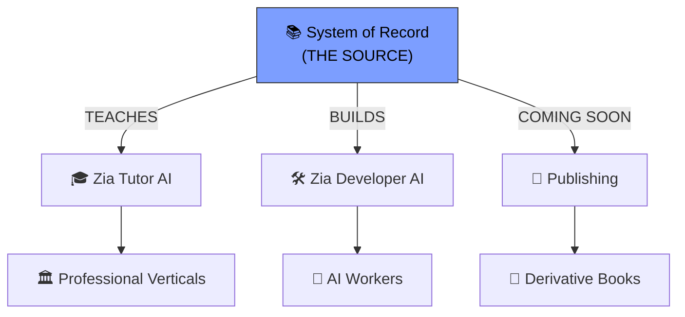
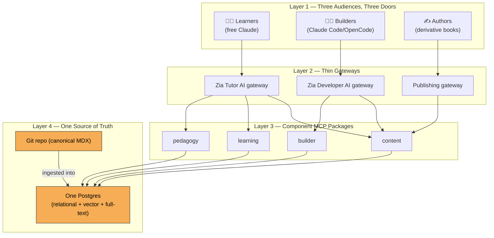
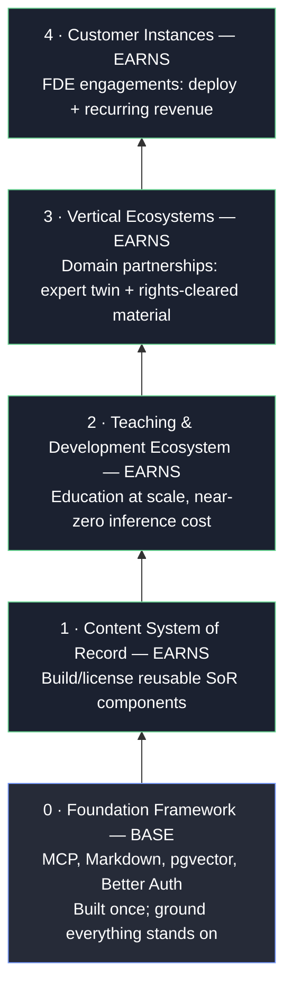

# 🌐 The Agent Factory Ecosystem

> **Course:** GIAIC Final Exam Marathon · Part 2 — Get Ready for the Market
> **Prerequisite:** [The Roles This Book Trains](./roles-this-book-trains-notes.md) → [The FDE-Agent Factory Model](./fde-af-model-notes.md) → [How to Get Paid](./how-to-get-paid-notes.md)
> **Note:** Yeh page khud short aur bohot **visual** hai — 3 major diagrams, thodi si prose. Notes mein Mermaid diagrams shamil hain (GitHub par khud render hote hain) taake wahi visual feel mile jo book mein hai. Asal book-images ke liye placeholders bhi rakhe hain.

---

## 📑 Table of Contents

- [Core Idea](#-core-idea)
- [Key Terms — Plain English Glossary](#-key-terms--plain-english-glossary)
- [1. One Source, Three Doors — The Hero Picture](#1-one-source-three-doors--the-hero-picture)
- [2. How It's Wired: One Source, Three Gateways](#2-how-its-wired-one-source-three-gateways)
- [3. The Economics — Why the Cost Is Near Zero](#3-the-economics--why-the-cost-is-near-zero)
- [4. The Business Model — Five Layers, Every Layer Earns](#4-the-business-model--five-layers-every-layer-earns)
- [5. The Seat That Matters Most](#5-the-seat-that-matters-most)
- [❌ Common Mistakes](#-common-mistakes)
- [💡 Pro Tips](#-pro-tips)
- [🧠 Memory Tricks](#-memory-tricks-yaad-rakhne-ke-tareeqe)
- [📌 One-Line Chapter Summary](#-one-line-chapter-summary-table)

---

## 🎯 Core Idea

> **One sentence:** *Ek System of Record — aur uske upar bane hue products jo sikhate hain aur banate hain, hazaaron logon tak pohanchte hain almost-zero AI cost pe.*

Book khud ek **System of Record** ban gayi, phir uske upar products banne shuru hue. Yeh "thesis, shipped" hai — jo pehle sirf idea tha (FDE AF Model), ab live products hain.

> 📌 **Key Takeaway:** Ek source, teen products, radiating outward — yeh koi 3 alag apps nahi, ek hi ecosystem hai jo same foundation se grow karta hai.

---

## 📖 Key Terms — Plain English Glossary

| Term | Plain-English Meaning |
|---|---|
| **System of Record (SoR)** | Book ka content, MCP se served — ek governed source of truth |
| **Gateway** | Har audience ke liye ek thin layer jo decide karti hai woh kya reach kar sakti hai |
| **Component MCP Package** | Reusable capability (content, learning, pedagogy, builder) — ek dafa banti hai, sab gateways use karti hain |
| **Canonical MDX** | Git repo mein rakha master copy — book ka "single source of truth" |
| **Connector-native app** | Chat app (jaise Claude) ke andar chalne wala tool — user apna model laata hai |
| **Plugin** | Coding agent (Claude Code/OpenCode) ke andar chalne wala tool |
| **Outcome Architect** | Intent ka malik — jo AI workforce ko batata hai kya banana hai |

---

## 1. One Source, Three Doors — The Hero Picture

4 products, sab ek hi source se:

| Status | Product | Kya Karta Hai |
|---|---|---|
| 🗃️ **Beta 1** | **System of Record** | Book ka content, MCP se served — kisi bhi agent ko connect karo (Claude, ChatGPT, Claude Code, Cowork) aur usse book mein ground karo |
| 🎓 **Coming Soon** | **Zia Tutor AI** | Book, Zia Khan ki apni voice mein taught — Claude ke andar, jahan aap already ho |
| 🛠️ **In Development** | **Zia Developer AI** | Aapka build partner Claude Code/OpenCode ke andar — problem describe karo, yeh sahi architecture pick kar ke spec likhta hai, agent banata hai |
| 📐 **Published** | **The FDE AF Model** | 5-layer blueprint jo in products ko platform + business model mein arrange karta hai |

> ❗ **Important Note:** Sab "read over MCP" karte hain aur "stays in sync" rehte hain — content ek jagah update hota hai, har product ko fix mil jaata hai.

---

## 2. How It's Wired: One Source, Three Gateways

> Diagram top se bottom parhi jaati hai: **kaun use karta hai → kis se connect hote hain → yeh connections kis se bani hain → truth kahan rehti hai.**

### Layer 1 — Three Audiences, Three Doors

| Audience | Door | Kyun |
|---|---|---|
| **Learners** | Apna free Claude | Ek connector add karo, ek dafa authorize karo — install/pay kuch nahi |
| **Builders** | Coding agent (Claude Code/OpenCode) | Plugin, kyunke construction wahi hoti hai |
| **Authors** | Publishing pipeline | Agents jo derivative books banate hain (topic/age/profession se rewritten) |

> 💡 **Tip:** Har audience ko wahin milo jahan woh already kaam karte hain — koi nayi app adopt nahi karni, koi nayi habit nahi banani.

### Layer 2 — Thin Gateways, One Per Audience

| Gateway | Lane |
|---|---|
| **Zia Tutor AI gateway** | Teaching lane — jab Zia greet karta hai, samajh check karta hai, progress record karta hai |
| **Zia Developer AI gateway** | Construction lane — jab Zia architecture pick karta hai, spec likhta hai, us pe build karta hai |
| **Publishing gateway** | Derivative-book pipeline, author agents ko canonical material deta hai specialize/rewrite karne ke liye |

> ⚠️ **Warning:** Gateways jaan-boojh kar **thin** hain — sirf decide karti hain audience kya reach kar sakti hai. Asal functionality ek layer neeche hai.

### Layer 3 — Component MCP Packages, Mounted Per Gateway

| Package | Kaam |
|---|---|
| **content** | Book bataur System of Record — har lane verified chapters/definitions/patterns parhti hai, training data se guess nahi karti |
| **learning** | Learner state — progress, history, kahan chhoda tha (Zia Tutor AI isi se din baad conversation resume karta hai) |
| **pedagogy** | Teaching moves — kaise explain karna hai, kab quiz lena hai, kaise correct karna hai — tools ki tarah encoded, model improvisation pe nahi chhoda |
| **builder** | Build patterns — specs, SKILL.md templates, recipes jo Zia Developer AI working agents mein assemble karta hai |

> 📌 **Key Takeaway:** **Composition, duplication nahi** — har gateway sirf woh mount karti hai jo usse chahiye; content package ek dafa fix karo, teeno lanes ko fix milta hai.

### Layer 4 — One Source of Truth, One Database

| Component | Kya Hai |
|---|---|
| **Git repo (canonical)** | Book, MDX format mein — har chapter/figure/definition ki master copy. Yahan badlo, sab upar inherit karta hai |
| **One Postgres** | Baaki sab kuch — relational data, vector embeddings, full-text search, ek hi database mein. Canonical MDX ingest hoti hai taake packages fast query kar sakein |

> ❗ **Important Note:** Book ka apna thesis khud pe apply hota hai: **default se consolidate karo, jaan-boojh kar specialize karo.**

### Why This Shape

> 📌 **Key Takeaway:** Truth ek dafa define hoti hai (Git), ek dafa store hoti hai (Postgres), reusable capabilities se expose hoti hai (packages), aur thin audience-shaped doors se deliver hoti hai (gateways). Naya product (nayi audience, nayi lane) baad mein add karna sirf **ek aur thin gateway** hai, same packages pe. **Source kabhi nahi badalta** — yehi isse ecosystem banata hai, teen alag apps nahi.

---

## 3. The Economics — Why the Cost Is Near Zero

> **📌 Definition:** Connector-native apps aur plugins **tools** laate hain; **user apna model laata hai.** Yeh economics ulti kar deta hai.

| Purana Model | Yeh Model |
|---|---|
| Company LLM inference cost uthati hai | User apne free-tier Claude se aata hai, tool sirf logic deta hai |
| Reach LLM bill se capped hoti hai | Hazaaron logon tak scale ho sakti hai, bina LLM bill ke jo usually reach cap karti hai |

> 💡 **Tip:** Khud yeh banana seekhne ke liye: [Connector-Native Apps](https://agentfactory.panaversity.org/docs/connector-native-apps), [Plugins for AI Agents](https://agentfactory.panaversity.org/docs/plugins-crash-course), [AI Identity (auth)](https://agentfactory.panaversity.org/docs/ai-identity-crash-course), [RAG on Postgres](https://agentfactory.panaversity.org/docs/postgres-ai-crash-course).

---

## 4. The Business Model — Five Layers, Every Layer Earns

> Yeh ecosystem khud is model ka **ek instance** hai — jise course mein **FDE AF Model** kaha gaya. Foundation ke upar har layer graduates ke liye ek earning jagah hai.

| Layer | Status | Kaise Kamati Hai |
|---|---|---|
| **0 — Foundation** | BASE | Ground jahan sab khada hota hai; khud kamati nahi |
| **1 — Content SoR** | EARNS | Reusable SoR components build/license karo, solo ya ecosystem contribution se |
| **2 — Teaching/Dev** | EARNS | Education at scale, near-zero inference cost — kyunke user apna model laata hai |
| **3 — Vertical Ecosystems** | EARNS | Domain partnerships — expert twin aur rights-cleared material license karo |
| **4 — Customer Instances** | EARNS | FDE engagements — ek company mein deploy karo, phir recurring revenue ke liye chalao |

> ✅ **Next Steps (agar model pe sold ho chuke ho):** [Choosing Your Vertical](https://agentfactory.panaversity.org/docs/ecosystem/choosing-your-vertical) — screen, 8 tests, launch gates. Phir [Designing the Vertical System of Record](https://agentfactory.panaversity.org/docs/ecosystem/designing-the-vertical-sor) — pehli cheez jo banao usme kya jaata hai.

---

## 5. The Seat That Matters Most

> 📌 **Key Takeaway:** AI workforce jitni badhti hai, utna hi zyada woh us insaan pe depend karti hai jo precisely bata sake **kya banana hai** — yeh **Outcome Architect** hai, intent ka malik.

Yeh products wahi hain jo us role ke saath banti hain — aur ecosystem [vertical businesses](https://agentfactory.panaversity.org/docs/ecosystem/fde-af-model) mein grow hone ke liye design hui hai jo woh role chala sakta hai.

---

## ❌ Common Mistakes

| Mistake | Kyun Galat Hai |
|---|---|
| Zia Tutor AI, Zia Developer AI, Publishing ko 3 alag apps samajhna | Yeh ek hi ecosystem hai, ek hi source pe — teen doors, ek building |
| Gateway ko "functionality" samajhna | Gateway thin hai; asal kaam component MCP packages karte hain, ek layer neeche |
| Sochna ke user apna model laane se reach limited hoti hai | Ulta hai — yehi wajah hai reach LLM-bill-capped nahi hoti |
| Naya product = poora naya system banana samajhna | Naya product sirf ek naya thin gateway hai, same packages pe |
| Layer 0 ko bhi "earning layer" samajhna | Layer 0 sirf BASE hai — foundation, khud kamati nahi |

## 💡 Pro Tips

- 💡 Agar apna agent banana hai, System of Record se seedha connect karo (MCP) — training data pe guess karne ki bajaye verified content parhega
- 💡 Connector-native app ya plugin banate waqt yaad rakho: user apna model laata hai, aap sirf tools/logic dete ho
- 💡 Ecosystem ka khud apna structure (Git → Postgres → Packages → Gateways) copy karne layak pattern hai apne vertical ke liye
- 💡 "Composition, not duplication" — apne components bhi is tarah design karo ke ek fix sab jagah pohanche

## 🧠 Memory Tricks (Yaad Rakhne Ke Tareeqe)

- **4 Layers = Audience → Gateway → Package → Source** (top se bottom)
- **"Thin gateways, thick packages"** — gateway sirf decide karta hai, package kaam karta hai
- **"User brings the model"** = near-zero cost ka raaz
- **5-Layer Earning Map = Foundation (base) → SoR → Teaching → Vertical → Customer** (sab EARNS, sirf Foundation nahi)
- **"One source, many products"** — is poore chapter ka one-liner

---

## 📌 One-Line Chapter Summary Table

| Section | One-Line Takeaway |
|---|---|
| 1. One Source, Three Doors | Ek SoR se 4 products radiate karte hain — SoR, Zia Tutor AI, Zia Developer AI, FDE AF Model |
| 2. How It's Wired | 4 layers: Audiences → Thin Gateways → Component Packages → Git/Postgres source |
| 3. Economics | User apna model laata hai — isi liye reach LLM-bill se capped nahi hoti |
| 4. Business Model | 5-layer earning map — Foundation base hai, baaqi 4 layers sab kamate hain |
| 5. The Seat That Matters | Outcome Architect — jitni AI workforce badhti hai, utna hi zaroori |

---

# 🌐 The Agent Factory Ecosystem
### One Source, Many Products • 5 Sections • GIAIC Agent Factory

**Built By Ismail Ahmed Shah | GIAIC 2026**

Made with ❤️ for the AI Builders Community

