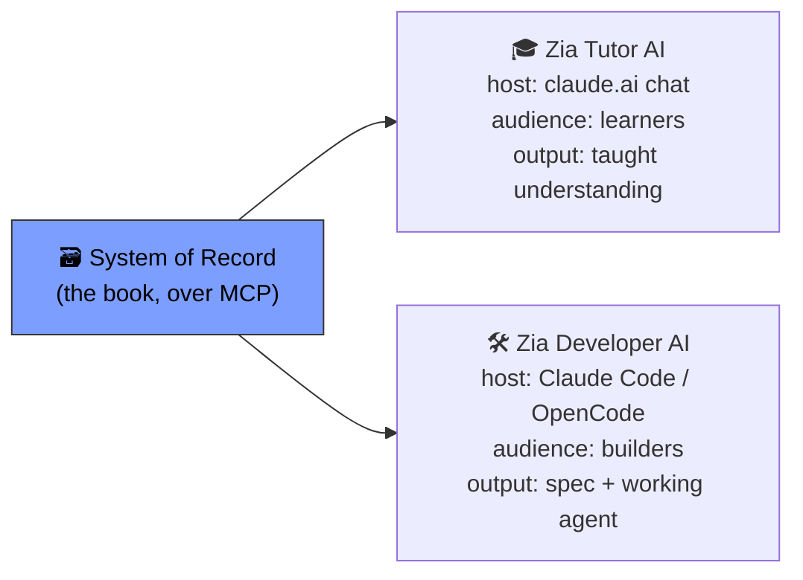

# 🗃️🎓🛠️ The Three Products: System of Record, Zia Tutor AI, Zia Developer AI

> **Course:** GIAIC Final Exam Marathon · Part 2 — Get Ready for the Market
> **Prerequisite:** [The Agent Factory Ecosystem](./ecosystem-notes.md)
> **Note:** Yeh 3 product-overview pages hain (Ecosystem chapter ke nested pages), har ek chhota (300-500 words). Isi liye ek combined notes document mein diye gaye hain — sab ek Step (9) mein MCQ ban sakein.

---

## 📑 Table of Contents

- [Core Idea — Same Source, Different Hosts](#-core-idea--same-source-different-hosts)
- [Quick Comparison Table](#-quick-comparison-table)
- [1. Agent Factory System of Record](#1-agent-factory-system-of-record)
- [2. Zia Tutor AI](#2-zia-tutor-ai)
- [3. Zia Developer AI](#3-zia-developer-ai)
- [4. How the Two Zias Mirror Each Other](#4-how-the-two-zias-mirror-each-other)
- [❌ Common Mistakes](#-common-mistakes)
- [💡 Pro Tips](#-pro-tips)
- [🧠 Memory Tricks](#-memory-tricks-yaad-rakhne-ke-tareeqe)
- [📌 One-Line Summary Table](#-one-line-summary-table)

---

## 🎯 Core Idea — Same Source, Different Hosts

> **One sentence:** *Teeno products **ek hi System of Record** parhte hain — sirf host, audience, aur output alag hai.*

> 📌 **Key Takeaway:** Ecosystem chapter ka "one source, three doors" hero yahan concrete banta hai — yeh teen pages hi woh teen doors hain, detail mein.

---

## 📊 Quick Comparison Table

| | System of Record | Zia Tutor AI | Zia Developer AI |
|---|---|---|---|
| **Status** | 🗃️ Beta 1 (live) | 🎓 Coming soon | 🛠️ In development |
| **Host** | Any MCP client | claude.ai chat (connector-native app) | Claude Code / OpenCode (plugin) |
| **Audience** | Any agent/worker | Learners | Builders |
| **What it gives** | Grounded answers, citations | Structured, progress-aware teaching | Architecture decision + spec + built agent |
| **FDE AF Model role** | Layer 1 — SoR kernel (first instance) | Layer 2 — reference expert twin | Layer 2 — reference domain builder |
| **Cost model** | Read-only, free to connect | Free tier of your AI app | Installs via marketplace, one command |

---

## 1. Agent Factory System of Record

> **📌 Definition:** Book ka content, chunk + embed karke MCP se served — koi bhi agent/worker connect ho sakta hai (Claude, ChatGPT, Claude Code, Cowork, ya apna khud ka).

### 4 Feature Cards

| Card | Kya Deta Hai |
|---|---|
| **Connect any agent or worker** | Jo bhi MCP bolta hai, connect ho sakta hai — one source, any host |
| **Grounded, not guessing** | Book se jawab deta hai, exact section cite karta hai; source unreachable ho to **fail closed** (guess nahi karta) |
| **Stays live with the book** | Jab bhi book publish hoti hai, re-ingest hoti hai — kabhi drift nahi hoti |
| **The book's own stack** | Postgres + pgvector, read-only MCP tools — wahi pattern jo book khud sikhati hai, apne upar apply kiya |

> ❗ **Important Note (Layer 1 Link):** FDE AF Model mein yeh record **Layer 1 ka pehla instance hai — the SoR kernel**. Wahi component jo is book ko serve karta hai, har vertical ka corpus bhi serve karega (accounting standards, clinical protocols, regulations). **Ek component, kai corpora.**

> ⚠️ **Warning:** Abhi beta mein hai — **book ka core content** (About se Glossary tak) serve karta hai, "~80% path jahan zyada tar value hai" — poora book nahi.

### Connection Steps (7 steps, high-level)
Claude Connectors mein jao → Add custom connector → Name + MCP Server URL paste karo → Advanced settings mein OAuth Client ID paste karo (Client Secret khaali) → Add → Connect → authorize karo → test karo.

> 💡 **Tip:** Yeh sirf ek demo nahi — is book ki khud ki dogfooding hai. Padhne se pehle khud connect kar ke dekho.

---

## 2. Zia Tutor AI

> **📌 Definition:** Connector-native app — learner ke already-used AI app (Claude) ke andar rehta hai, structured progress-aware course deta hai, **Zia Khan ki apni awaaz mein**.

### 4 Feature Cards

| Card | Kya Deta Hai |
|---|---|
| **Taught by Zia, not a system** | Ek insaan ki awaaz/method/personality — faceless assistant nahi. Beginners ke liye yehi cheez unhe chair mein rakhti hai |
| **It remembers you** | Naam se greet karta hai, hafton baad bhi wahin se resume karta hai jahan chhoda tha — jab tak samajh na dikhaye, aage nahi badhta |
| **One connector, three records** | Book ka content + learner ki apni progress + teacher ki persona — sab ek hi connector ke peeche |
| **Near-zero cost, built to scale** | Free tier pe chalta hai — koi LLM bill jo tutor ki reach ko cap kare, nahi hoti |

### How You'll Use It (3 steps)
1. Apne AI app (abhi Claude) mein ek connector add karo, ek dafa authorize karo
2. Normal chat kholo, kaho "Teach me the Agent Factory"
3. Zia ki awaaz mein seekho, phir wapas aa ke kaho "continue where I left off"

> ❗ **Important Note (Layer 2 Link):** FDE AF Model mein Zia Tutor AI **reference expert twin** hai — Layer 2 ka slot jo har vertical apne khud ke domain expert se fill karega, **usi expert ki awaaz mein sikhate hue jaisa yeh Zia ki awaaz mein sikhata hai.**

---

## 3. Zia Developer AI

> **📌 Definition:** Coding agent (Claude Code/OpenCode) ke liye plugin — business problem plain language mein describe karo, yeh **decision** deta hai (guess nahi): Mode 1 ya Mode 2, aur kaunsi shape — book se grounded — phir spec likhta hai aur working agent banata hai.

### 4 Feature Cards

| Card | Kya Deta Hai |
|---|---|
| **Decides, then builds** | Book ke decision gates chalata hai sahi shape choose karne ke liye, cite karta hai kyun, spec likhta hai, deployable agent scaffold karta hai — throwaway skeleton nahi |
| **Never guesses at a gate** | Agar requirements decision settle nahi karte, ek sab se sharp sawaal poochta hai aur wait karta hai — spec-driven discipline, architecture choice pe bhi apply |
| **In the agent you already use** | Claude Code/OpenCode mein ek command se install; decision knowledge ek portable skill hai — har host tak pohanchti hai, economy-tier models tak bhi |
| **Grounded in the same well** | Wahi System of Record parhta hai jo Zia Tutor AI parhta hai — har recommendation book se grounded, aur agar cite na kar sake to architecture invent nahi karta (**fail closed**) |

> ❗ **Important Note (Layer 2 Link):** FDE AF Model mein Zia Developer AI **reference domain builder** hai — Layer 2 ka slot jo har vertical apne khud ke architectures aur compliance rules se preload karega, taake usse banaye Workers us profession ke constraints **by default** respect karein.

### The 10-80-10 Rhythm It Enforces
| Slice | Kaun Karta Hai | Kya |
|---|---|---|
| First 10% | **Zia Developer AI** | Intent — architecture decision + spec |
| Middle 80% | **Coding agent** | Build execute karta hai |
| Final 10% | **Aapka judgment** | Loop close karta hai — verify + ship |

> 📌 **Key Takeaway:** Yeh book ka 10-80-10 principle hai, building pe apply kiya gaya — Zia Developer AI decide karta hai, coding agent banata hai, aap verify kar ke ship karte ho.

---

## 4. How the Two Zias Mirror Each Other

> **Ecosystem chapter se direct quote:** *"It's the mirror of Zia Tutor AI: same source, the other host. Where the tutor teaches the method, the developer makes it run."*

| | Zia Tutor AI | Zia Developer AI |
|---|---|---|
| **Same architectural move, applied to** | Chat app (claude.ai) | Coding agent (Claude Code/OpenCode) |
| **Reaches** | Learners, everywhere, free tier | Builders, everywhere, already in-hand tools |
| **Role in FDE AF Model** | Reference **expert twin** | Reference **domain builder** |
| **Verb** | Teaches | Builds |

> ✅ **Best Practice — Why This Matters for Your Own Vertical:** Jab aap apni vertical banate ho, yeh do reference implementations hain jo dikhate hain **expert twin** aur **domain builder** actually kaise dikhte/kaam karte hain — copy karne layak pattern.

---

## ❌ Common Mistakes

| Mistake | Kyun Galat Hai |
|---|---|
| System of Record ko poora book samajhna | Beta mein sirf core content (~80% path) serve karta hai |
| Zia Tutor AI aur Zia Developer AI ko do alag, unrelated products samajhna | Dono same architectural move hain, do alag hosts pe — mirror images |
| Sochna ke Zia Developer AI seedha code likhta hai | Woh decide karta hai + spec likhta hai (10%); coding agent build karta hai (80%) |
| "Fail closed" ko crash samajhna | Fail closed matlab guess nahi karta / invent nahi karta — silently wrong answer dene se behtar hai |
| Layer 2 ke "reference" implementations ko fixed template samajhna | Yeh sirf pattern hain — har vertical apna khud ka expert twin/domain builder banata hai |

## 💡 Pro Tips

- 💡 Apna agent test karne ke liye pehle System of Record se khud connect karo — dogfooding dekho
- 💡 Zia Developer AI se kaam lete waqt clear business problem describe karo — woh sharp sawaal poochega agar kuch unclear ho
- 💡 Apni vertical design karte waqt in dono ko reference implementations ki tarah study karo (expert twin, domain builder)
- 💡 10-80-10 ko apne khud ke build process mein bhi apply karo — intent decide karo, execute karwao, khud verify karo

## 🧠 Memory Tricks (Yaad Rakhne Ke Tareeqe)

- **"Same source, other host"** — dono Zias ka rishta ek line mein
- **Tutor teaches, Developer builds** — verb se yaad rakho
- **10-80-10 = Decide (Zia) → Build (agent) → Verify (aap)**
- **Fail closed, not guess** — teeno products ka shared safety principle
- **SoR = Layer 1 kernel; Tutor/Developer = Layer 2 reference twin/builder**

---

## 📌 One-Line Summary Table

| Product | One-Line Takeaway |
|---|---|
| System of Record | Book, MCP se served, grounded/citable, koi bhi agent connect ho sakta hai — Layer 1 ka pehla instance |
| Zia Tutor AI | Learner ke apne Claude ke andar, Zia ki awaaz mein taught, progress-aware — Layer 2 ka reference expert twin |
| Zia Developer AI | Coding agent ke andar, decide+spec+build karta hai, 10-80-10 enforce karta hai — Layer 2 ka reference domain builder |
| The Mirror | Dono same move, do hosts pe — "tutor teaches, developer builds" |

---

# 🗃️🎓🛠️ The Three Products
### System of Record • Zia Tutor AI • Zia Developer AI • GIAIC Agent Factory

**Built By Ismail Ahmed Shah | GIAIC 2026**

Made with ❤️ for the AI Builders Community

